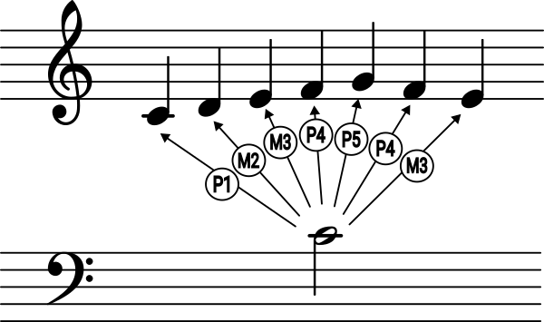

Interval Fans
==========================

An **interval fan** is a harmonic primitive describing the relative
interval distances of the elements of a scale or a sequence from the
vantage point of a tonal center. This is in contrast to the
:doc:`interval sequence <prim_interval_seq>` primitive which describes
the relative distances of notes/pitches in a scale or sequence
*to each other*.

Interval fans describe movement in relation to a tonal center *without*
specifying that center. This situates them closely to both transformation
theory and tonal music. However they are also simply a common form to
denote an abstract scale, e.g. in Scale Workshop or Scala.

We start with an example from tonal analysis:

.. testcode::

   from xenharmlib import WesternNotation
   western = WesternNotation()

   # the melodic structure of the first measure of Bach's
   # Fuga 1 from "Das Wohltemperierte Klavier" (BWV 846) 

   seq = western.seq([western.note(pcs, 4) for pcs in 'CDEFGFEA'])
   tonic = western.note('C', 4)

   ifan = seq.to_interval_fan(tonic)
   print(ifan)

.. testoutput::

   WesternNoteIntervalFan([P1, M2, M3, P4, P5, P4, M3, M6])

We received an abstract formulation of the melodic line. We start from
"the tonic" (whatever it is), then move a minor second over the tonic,
then a minor third, etc. We can now analyze the piece from a different
viewpoint, not as a sequence of notes, but a sequence of distances
from the "center of gravity".
Vice versa, we can use the interval fan to descend again to the layer of
notes, "de-abstract" it by giving it a new tonic, for example D#:

.. testcode::

   new_tonic = western.note('D#', 4)
   print(new_tonic.seq(ifan))

.. testoutput::

   WesternNoteSeq([D#4, E#4, Fx4, G#4, A#4, G#4, Fx4, B#4])

We can also start directly from an interval fan and then use it as
a template to "stamp out" different scales and sequences. Especially
in writings about Just Intonation scales are often given as interval
fans:

.. testcode::

   from xenharmlib import PrimeLimitTuning

   limit5 = PrimeLimitTuning(5)

   major_chord = limit5.rs_interval_fan(['1/1', '5/4', '3/2'])
   G0 = limit5.rs_pitch('3/2')

   print(G0.scale(major_chord))

.. testoutput::

   PrimeLimitPitchScale([3/2, 15/8, 9/4], 5-Limit)

Deriving Interval Fans from Intervals
----------------------------------------

You can create interval fans by an iterable of single interval objects
with the default builder method
:meth:`~xenharmlib.core.origin_context.OriginContext.interval_fan`:

.. tabs::

   .. tab:: EDO

      .. testcode:: EDOTuning

         from xenharmlib import EDOTuning
         edo31 = EDOTuning(31)

         P1 = edo31.diff_interval(0)
         M3 = edo31.diff_interval(10)
         P5 = edo31.diff_interval(18)

         ifan = edo31.interval_fan([P1, M3, P5])
         print(ifan)

      .. testoutput:: EDOTuning

         EDOPitchIntervalFan([0, 10, 18], 31-EDO)

   .. tab:: Prime Limit

      .. testcode:: PrimeLimitTuning

         from xenharmlib import PrimeLimitTuning
         limit5 = PrimeLimitTuning(5)

         P1 = limit5.rs_interval('1/1')
         M3_pure = limit5.rs_interval('5/4')
         P5 = limit5.rs_interval('3/2')

         ifan = limit5.interval_fan([P1, M3_pure, P5])
         print(ifan)

      .. testoutput:: PrimeLimitTuning

         PrimeLimitPitchIntervalFan([1, 5/4, 3/2], 5-Limit)

   .. tab:: Western

      .. testcode:: WesternNotation

         from xenharmlib import WesternNotation
         western = WesternNotation()

         P1 = western.shorthand_interval('P', 1)
         M3 = western.shorthand_interval('M', 3)
         P5 = western.shorthand_interval('P', 5)

         ifan = western.interval_fan([P1, M3, P5])
         print(ifan)

      .. testoutput:: WesternNotation

         WesternNoteIntervalFan([P1, M3, P5])

   .. tab:: UpDown

      .. testcode:: UpDownNotation

         from xenharmlib import EDOTuning
         from xenharmlib import UpDownNotation

         edo31 = EDOTuning(31)
         n_edo31 = UpDownNotation(edo31)

         P1 = n_edo31.shorthand_interval('P', 1)
         super_M3 = n_edo31.shorthand_interval('^M', 3)
         P5 = n_edo31.shorthand_interval('P', 5)

         ifan = n_edo31.interval_fan([P1, super_M3, P5])
         print(ifan)

      .. testoutput:: UpDownNotation

         UpDownNoteIntervalFan([P1, ^M3, P5], 31-EDO)

Element-wise Construction
----------------------------------------

Interval fans can be constructed element-wise. In line with xenharmlib's
immutable object design, this is not done with an append method like
in standard python, but with a method that returns a scale with
an additional element:

.. tabs::

   .. tab:: EDO

      .. testcode:: EDOTuning

         from xenharmlib import EDOTuning
         edo31 = EDOTuning(31)

         P1 = edo31.diff_interval(0)
         M3 = edo31.diff_interval(10)
         P5 = edo31.diff_interval(18)

         # start with empty fan
         ifan = edo31.interval_fan()

         for i in [P1, M3, P5]:
             ifan = ifan.with_interval(i)
             print(ifan)

      .. testoutput:: EDOTuning

         EDOPitchIntervalFan([0], 31-EDO)
         EDOPitchIntervalFan([0, 10], 31-EDO)
         EDOPitchIntervalFan([0, 10, 18], 31-EDO)

   .. tab:: Prime Limit

      .. testcode:: PrimeLimitTuning

         from xenharmlib import PrimeLimitTuning
         limit5 = PrimeLimitTuning(5)

         P1 = limit5.rs_interval('1/1')
         M3_pure = limit5.rs_interval('5/4')
         P5 = limit5.rs_interval('3/2')

         # start with empty fan
         ifan = limit5.interval_fan()

         for i in [P1, M3_pure, P5]:
             ifan = ifan.with_interval(i)
             print(ifan)

      .. testoutput:: PrimeLimitTuning

         PrimeLimitPitchIntervalFan([1], 5-Limit)
         PrimeLimitPitchIntervalFan([1, 5/4], 5-Limit)
         PrimeLimitPitchIntervalFan([1, 5/4, 3/2], 5-Limit)

   .. tab:: Western

      .. testcode:: WesternNotation

         from xenharmlib import WesternNotation
         western = WesternNotation()

         P1 = western.shorthand_interval('P', 1)
         M3 = western.shorthand_interval('M', 3)
         P5 = western.shorthand_interval('P', 5)

         # start with empty fan
         ifan = western.interval_fan()

         for i in [P1, M3, P5]:
             ifan = ifan.with_interval(i)
             print(ifan)

      .. testoutput:: WesternNotation

         WesternNoteIntervalFan([P1])
         WesternNoteIntervalFan([P1, M3])
         WesternNoteIntervalFan([P1, M3, P5])

   .. tab:: UpDown

      .. testcode:: UpDownNotation

         from xenharmlib import EDOTuning
         from xenharmlib import UpDownNotation

         edo31 = EDOTuning(31)
         n_edo31 = UpDownNotation(edo31)

         P1 = n_edo31.shorthand_interval('P', 1)
         super_M3 = n_edo31.shorthand_interval('^M', 3)
         P5 = n_edo31.shorthand_interval('P', 5)

         # start with empty fan
         ifan = n_edo31.interval_fan()

         for i in [P1, super_M3, P5]:
             ifan = ifan.with_interval(i)
             print(ifan)

      .. testoutput:: UpDownNotation

         UpDownNoteIntervalFan([P1], 31-EDO)
         UpDownNoteIntervalFan([P1, ^M3], 31-EDO)
         UpDownNoteIntervalFan([P1, ^M3, P5], 31-EDO)

Instead of appending intervals at the end of the fan users can also give
an additional parameter to define where the new interval should appear:

.. tabs::

   .. tab:: EDO

      .. testcode:: EDOTuning

         from xenharmlib import EDOTuning
         edo31 = EDOTuning(31)

         P1 = edo31.diff_interval(0)
         M3 = edo31.diff_interval(10)
         P5 = edo31.diff_interval(18)

         # start with empty fan
         ifan = edo31.interval_fan()

         for i in [P1, M3, P5]:
             ifan = ifan.with_interval(i, 0)
             print(ifan)

      .. testoutput:: EDOTuning

         EDOPitchIntervalFan([0], 31-EDO)
         EDOPitchIntervalFan([10, 0], 31-EDO)
         EDOPitchIntervalFan([18, 10, 0], 31-EDO)

   .. tab:: Prime Limit

      .. testcode:: PrimeLimitTuning

         from xenharmlib import PrimeLimitTuning
         limit5 = PrimeLimitTuning(5)

         P1 = limit5.rs_interval('1/1')
         M3_pure = limit5.rs_interval('5/4')
         P5 = limit5.rs_interval('3/2')

         # start with empty fan
         ifan = limit5.interval_fan()

         for i in [P1, M3_pure, P5]:
             ifan = ifan.with_interval(i, 0)
             print(ifan)

      .. testoutput:: PrimeLimitTuning

         PrimeLimitPitchIntervalFan([1], 5-Limit)
         PrimeLimitPitchIntervalFan([5/4, 1], 5-Limit)
         PrimeLimitPitchIntervalFan([3/2, 5/4, 1], 5-Limit)

   .. tab:: Western

      .. testcode:: WesternNotation

         from xenharmlib import WesternNotation
         western = WesternNotation()

         P1 = western.shorthand_interval('P', 1)
         M3 = western.shorthand_interval('M', 3)
         P5 = western.shorthand_interval('P', 5)

         # start with empty fan
         ifan = western.interval_fan()

         for i in [P1, M3, P5]:
             ifan = ifan.with_interval(i, 0)
             print(ifan)

      .. testoutput:: WesternNotation

         WesternNoteIntervalFan([P1])
         WesternNoteIntervalFan([M3, P1])
         WesternNoteIntervalFan([P5, M3, P1])

   .. tab:: UpDown

      .. testcode:: UpDownNotation

         from xenharmlib import EDOTuning
         from xenharmlib import UpDownNotation

         edo31 = EDOTuning(31)
         n_edo31 = UpDownNotation(edo31)

         P1 = n_edo31.shorthand_interval('P', 1)
         super_M3 = n_edo31.shorthand_interval('^M', 3)
         P5 = n_edo31.shorthand_interval('P', 5)

         # start with empty fan
         ifan = n_edo31.interval_fan()

         for i in [P1, super_M3, P5]:
             ifan = ifan.with_interval(i, 0)
             print(ifan)

      .. testoutput:: UpDownNotation

         UpDownNoteIntervalFan([P1], 31-EDO)
         UpDownNoteIntervalFan([^M3, P1], 31-EDO)
         UpDownNoteIntervalFan([P5, ^M3, P1], 31-EDO)

Index-based Construction
----------------------------------------

Interval fans can also conveniently be constructed by providing a list
of indices, which - depending on origin context - can be integers or
lattice points. This type of construction also works on the notation
layer by employing the notation's enharmonic strategy.

.. tabs::

   .. tab:: EDO

      .. testcode:: EDOTuning

         from xenharmlib import EDOTuning
         edo31 = EDOTuning(31)

         ifan = edo31.diff_interval_fan([0, 10, 18])
         print(ifan)

      .. testoutput:: EDOTuning

         EDOPitchIntervalFan([0, 10, 18], 31-EDO)

   .. tab:: Prime Limit

      .. testcode:: PrimeLimitTuning

         from xenharmlib import PrimeLimitTuning
         limit5 = PrimeLimitTuning(5)

         ifan = limit5.diff_interval_fan(
             [
                 limit5.lattice.point((0, 0, 0)),
                 limit5.lattice.point((-3, 2, 0)),
                 limit5.lattice.point((-2, 0, 1)),
             ]
         )
         print(ifan)

      .. testoutput:: PrimeLimitTuning

         PrimeLimitPitchIntervalFan([1, 9/8, 5/4], 5-Limit)

   .. tab:: Western

      .. testcode:: WesternNotation

         from xenharmlib import WesternNotation
         western = WesternNotation()

         ifan = western.diff_interval_fan([0, 5, 7])
         print(ifan)

      .. testoutput:: WesternNotation

         WesternNoteIntervalFan([P1, P4, P5])

   .. tab:: UpDown

      .. testcode:: UpDownNotation

         from xenharmlib import EDOTuning
         from xenharmlib import UpDownNotation

         edo31 = EDOTuning(31)
         n_edo31 = UpDownNotation(edo31)

         ifan = n_edo31.diff_interval_fan([0, 11, 18])
         print(ifan)

      .. testoutput:: UpDownNotation

         UpDownNoteIntervalFan([P1, d4, P5], 31-EDO)

Construction Based on Closest Frequency Ratio
-----------------------------------------------------

Origin contexts based on integer indices allow construction based on the
approximation of frequency ratios. Given an arbitrary iterable of frequency
ratios the 
:meth:`~xenharmlib.core.origin_context.OriginContext.closest_interval_fan`
method returns the interval fan of an origin context that is closest to it:

.. tabs::

   .. tab:: EDO

      .. testcode:: EDOTuning

         from xenharmlib import EDOTuning
         from xenharmlib import FrequencyRatio

         edo31 = EDOTuning(31)
         ratios = [
             FrequencyRatio(1, 1),
             FrequencyRatio(5, 4),
             FrequencyRatio(3, 2),
             FrequencyRatio(7, 4),
         ]

         ifan = edo31.closest_interval_fan(ratios)
         print(ifan)

      .. testoutput:: EDOTuning

         EDOPitchIntervalFan([0, 10, 18, 25], 31-EDO)

   .. tab:: Western

      .. testcode:: WesternNotation

         from xenharmlib import WesternNotation
         from xenharmlib import FrequencyRatio

         western = WesternNotation()
         ratios = [
             FrequencyRatio(1, 1),
             FrequencyRatio(5, 4),
             FrequencyRatio(3, 2),
             FrequencyRatio(7, 4),
         ]

         ifan = western.closest_interval_fan(ratios)
         print(ifan)

      .. testoutput:: WesternNotation

         WesternNoteIntervalFan([P1, M3, P5, A6])

   .. tab:: UpDown

      .. testcode:: UpDownNotation

         from xenharmlib import EDOTuning
         from xenharmlib import UpDownNotation
         from xenharmlib import FrequencyRatio

         edo31 = EDOTuning(31)
         n_edo31 = UpDownNotation(edo31)
         ratios = [
             FrequencyRatio(1, 1),
             FrequencyRatio(5, 4),
             FrequencyRatio(3, 2),
             FrequencyRatio(7, 4),
         ]

         ifan = n_edo31.closest_interval_fan(ratios)
         print(ifan)

      .. testoutput:: UpDownNotation

         UpDownNoteIntervalFan([P1, M3, P5, A6], 31-EDO)

Iteration
--------------------------------------------

Interval fans support iteration over their elements:

.. tabs::

   .. tab:: EDO

      .. testcode:: EDOTuning

         from xenharmlib import EDOTuning
         edo31 = EDOTuning(31)

         ifan = edo31.diff_interval_fan([10, 8, 7, 10])

         for interval in ifan:
             print('-->', interval)

      .. testoutput:: EDOTuning

         --> EDOPitchInterval(10, 31-EDO)
         --> EDOPitchInterval(8, 31-EDO)
         --> EDOPitchInterval(7, 31-EDO)
         --> EDOPitchInterval(10, 31-EDO)

   .. tab:: Prime Limit

      .. testcode:: PrimeLimitTuning

         from xenharmlib import PrimeLimitTuning
         limit5 = PrimeLimitTuning(5)

         ifan = limit5.rs_interval_fan(['5/4', '6/5', '5/4', '10/9'])

         for interval in ifan:
             print('-->', interval)

      .. testoutput:: PrimeLimitTuning

         --> PrimeLimitPitchInterval(5/4, 5-Limit)
         --> PrimeLimitPitchInterval(6/5, 5-Limit)
         --> PrimeLimitPitchInterval(5/4, 5-Limit)
         --> PrimeLimitPitchInterval(10/9, 5-Limit)

   .. tab:: Western

      .. testcode:: WesternNotation

         from xenharmlib import WesternNotation
         western = WesternNotation()

         ifan = western.diff_interval_fan([3, 5, 5, 3, 5])

         for interval in ifan:
             print('-->', interval)

      .. testoutput:: WesternNotation

         --> WesternNoteInterval(A, 2)
         --> WesternNoteInterval(P, 4)
         --> WesternNoteInterval(P, 4)
         --> WesternNoteInterval(A, 2)
         --> WesternNoteInterval(P, 4)

   .. tab:: UpDown

      .. testcode:: UpDownNotation

         from xenharmlib import EDOTuning
         from xenharmlib import UpDownNotation

         edo31 = EDOTuning(31)
         n_edo31 = UpDownNotation(edo31)

         ifan = n_edo31.diff_interval_fan([10, 11, 10, 10, 18])

         for interval in ifan:
             print('-->', interval)

      .. testoutput:: UpDownNotation

         --> UpDownNoteInterval(M, 3, 31-EDO)
         --> UpDownNoteInterval(d, 4, 31-EDO)
         --> UpDownNoteInterval(M, 3, 31-EDO)
         --> UpDownNoteInterval(M, 3, 31-EDO)
         --> UpDownNoteInterval(P, 5, 31-EDO)

Containment
--------------------------------------------

If you want to know if a specific interval is contained inside of an
interval fan you can use the :code:`in` operator:

.. tabs::

   .. tab:: EDO

      .. testcode:: EDOTuning

         from xenharmlib import EDOTuning
         edo31 = EDOTuning(31)

         ifan = edo31.diff_interval_fan([10, 8, 7, 10])
         interval_a = edo31.diff_interval(7)
         interval_b = edo31.diff_interval(9)

         print(interval_a in ifan)
         print(interval_b in ifan)

      .. testoutput:: EDOTuning

         True
         False

   .. tab:: Prime Limit

      .. testcode:: PrimeLimitTuning

         from xenharmlib import PrimeLimitTuning
         limit5 = PrimeLimitTuning(5)

         ifan = limit5.rs_interval_fan(['5/4', '6/5', '5/4', '10/9'])
         interval_a = limit5.rs_interval('6/5')
         interval_b = limit5.rs_interval('3/2')

         print(interval_a in ifan)
         print(interval_b in ifan)

      .. testoutput:: PrimeLimitTuning

         True
         False

   .. tab:: Western

      .. testcode:: WesternNotation

         from xenharmlib import WesternNotation
         western = WesternNotation()

         ifan = western.diff_interval_fan([3, 5, 5, 3, 5])
         interval_a = western.shorthand_interval('P', 4)
         interval_b = western.shorthand_interval('P', 5)

         print(interval_a in ifan)
         print(interval_b in ifan)

      .. testoutput:: WesternNotation

         True
         False

   .. tab:: UpDown

      .. testcode:: UpDownNotation

         from xenharmlib import EDOTuning
         from xenharmlib import UpDownNotation

         edo31 = EDOTuning(31)
         n_edo31 = UpDownNotation(edo31)

         ifan = n_edo31.diff_interval_fan([10, 11, 10, 10, 18])
         interval_a = n_edo31.shorthand_interval('M', 3)
         interval_b = n_edo31.shorthand_interval('vM', 3)

         print(interval_a in ifan)
         print(interval_b in ifan)

      .. testoutput:: UpDownNotation

         True
         False

Identity
-------------------------------------------------------

Two interval fans are considered identical if each interval in one
interval fan corresponds to another interval in the other interval
fan at the same position.
This relation works across origin contexts, for example 12-EDO and
24-EDO interval fans, or western note interval fans can be identical:

.. testcode::

   from xenharmlib import EDOTuning
   from xenharmlib import UpDownNotation
   from xenharmlib import WesternNotation

   edo24 = EDOTuning(24)
   n_edo24 = UpDownNotation(edo24)
   western = WesternNotation()

   Cm_1 = edo24.diff_interval_fan([8, 6])
   Cm_2 = n_edo24.interval_fan(
       [
           n_edo24.shorthand_interval('M', 3),
           n_edo24.shorthand_interval('m', 3),
       ]
   )
   Cm_3 = western.interval_fan(
       [
           western.shorthand_interval('M', 3),
           western.shorthand_interval('m', 3),
       ]
   )

   print(Cm_1 == Cm_2 == Cm_3)

.. testoutput::

   True

Keep in mind that even if two interval fans might have the same symbolic
string representation in a notation, they are not necessarily equal. A major
third interval in 31-EDO has for example a different frequency ratio than a
major third interval in 12-EDO:

.. testcode::

   from xenharmlib import EDOTuning
   from xenharmlib import UpDownNotation

   edo31 = EDOTuning(31)
   n_edo31 = UpDownNotation(edo31)

   edo12 = EDOTuning(12)
   n_edo12 = UpDownNotation(edo12)

   Cm_1 = n_edo31.interval_fan(
       [
           n_edo31.shorthand_interval('M', 3),
           n_edo31.shorthand_interval('m', 3),
       ]
   )
   Cm_2 = n_edo12.interval_fan(
       [
           n_edo12.shorthand_interval('M', 3),
           n_edo12.shorthand_interval('m', 3),
       ]
   )

   print(Cm_1)
   print(Cm_2)

   print(Cm_1 == Cm_2)

.. testoutput::

   UpDownNoteIntervalFan([M3, m3], 31-EDO)
   UpDownNoteIntervalFan([M3, m3], 12-EDO)
   False

Item Retrieval and Slicing
~~~~~~~~~~~~~~~~~~~~~~~~~~~

Single intervals from the interval fan can be obtained by their index.
You can also use slices (including step size) to extract portions
of an interval sequence:

.. tabs::

   .. tab:: EDO

      .. testcode:: EDOTuning

         from xenharmlib import EDOTuning
         edo31 = EDOTuning(31)

         ifan = edo31.diff_interval_fan([10, 8, 7, 10])

         print(ifan[2])
         print(ifan[1:3])
         print(ifan[::2])

      .. testoutput:: EDOTuning

         EDOPitchInterval(7, 31-EDO)
         EDOPitchIntervalFan([8, 7], 31-EDO)
         EDOPitchIntervalFan([10, 7], 31-EDO)

   .. tab:: Prime Limit

      .. testcode:: PrimeLimitTuning

         from xenharmlib import PrimeLimitTuning
         limit5 = PrimeLimitTuning(5)

         ifan = limit5.rs_interval_fan(['5/4', '6/5', '5/4', '10/9'])

         print(ifan[2])
         print(ifan[1:3])
         print(ifan[::2])

      .. testoutput:: PrimeLimitTuning

         PrimeLimitPitchInterval(5/4, 5-Limit)
         PrimeLimitPitchIntervalFan([6/5, 5/4], 5-Limit)
         PrimeLimitPitchIntervalFan([5/4, 5/4], 5-Limit)

   .. tab:: Western

      .. testcode:: WesternNotation

         from xenharmlib import WesternNotation
         western = WesternNotation()

         ifan = western.diff_interval_fan([3, 5, 5, 3, 5])

         print(ifan[2])
         print(ifan[1:4])
         print(ifan[::2])

      .. testoutput:: WesternNotation

         WesternNoteInterval(P, 4)
         WesternNoteIntervalFan([P4, P4, A2])
         WesternNoteIntervalFan([A2, P4, P4])

   .. tab:: UpDown

      .. testcode:: UpDownNotation

         from xenharmlib import EDOTuning
         from xenharmlib import UpDownNotation

         edo31 = EDOTuning(31)
         n_edo31 = UpDownNotation(edo31)

         ifan = n_edo31.diff_interval_fan([10, 11, 10, 10, 18])

         print(ifan[1])
         print(ifan[1:4])
         print(ifan[::2])

      .. testoutput:: UpDownNotation

         UpDownNoteInterval(d, 4, 31-EDO)
         UpDownNoteIntervalFan([d4, M3, M3], 31-EDO)
         UpDownNoteIntervalFan([M3, M3, P5], 31-EDO)

Search
------------------

The :meth:`~xenharmlib.core.interval_fan.IntervalFan.index` method returns
the first index position where an interval was found (or raises
:code:`ValueError` if the interval does not exist in the interval fan). 

.. tabs::

   .. tab:: EDO

      .. testcode:: EDOTuning

         from xenharmlib import EDOTuning
         edo31 = EDOTuning(31)

         ifan = edo31.diff_interval_fan([10, 8, 7, 10])
         interval = edo31.diff_interval(7)

         print(ifan.index(interval))

      .. testoutput:: EDOTuning

         2

   .. tab:: Prime Limit

      .. testcode:: PrimeLimitTuning

         from xenharmlib import PrimeLimitTuning
         limit5 = PrimeLimitTuning(5)

         ifan = limit5.rs_interval_fan(['5/4', '6/5', '5/4', '10/9'])
         interval = limit5.rs_interval('6/5')

         print(ifan.index(interval))

      .. testoutput:: PrimeLimitTuning

         1

   .. tab:: Western

      .. testcode:: WesternNotation

         from xenharmlib import WesternNotation
         western = WesternNotation()

         ifan = western.diff_interval_fan([3, 5, 5, 3, 5])
         interval = western.shorthand_interval('P', 4)

         print(ifan.index(interval))

      .. testoutput:: WesternNotation

         1

   .. tab:: UpDown

      .. testcode:: UpDownNotation

         from xenharmlib import EDOTuning
         from xenharmlib import UpDownNotation

         edo31 = EDOTuning(31)
         n_edo31 = UpDownNotation(edo31)

         ifan = n_edo31.diff_interval_fan([10, 11, 10, 10, 18])
         interval = n_edo31.shorthand_interval('M', 3)

         print(ifan.index(interval))

      .. testoutput:: UpDownNotation

         0

Counting
------------------

For statistical analysis xenharmlib can calculate the number of times a
specific interval occurs in an interval fan:

.. tabs::

   .. tab:: EDO

      .. testcode:: EDOTuning

         from xenharmlib import EDOTuning
         edo31 = EDOTuning(31)

         ifan = edo31.diff_interval_fan([10, 8, 7, 10])
         interval = edo31.diff_interval(7)

         print(ifan.count(interval))

      .. testoutput:: EDOTuning

         1

   .. tab:: Prime Limit

      .. testcode:: PrimeLimitTuning

         from xenharmlib import PrimeLimitTuning
         limit5 = PrimeLimitTuning(5)

         ifan = limit5.rs_interval_fan(['5/4', '6/5', '5/4', '10/9'])
         interval = limit5.rs_interval('5/4')

         print(ifan.count(interval))

      .. testoutput:: PrimeLimitTuning

         2

   .. tab:: Western

      .. testcode:: WesternNotation

         from xenharmlib import WesternNotation
         western = WesternNotation()

         ifan = western.diff_interval_fan([3, 5, 5, 3, 5])
         interval = western.shorthand_interval('P', 4)

         print(ifan.count(interval))

      .. testoutput:: WesternNotation

         3

   .. tab:: UpDown

      .. testcode:: UpDownNotation

         from xenharmlib import EDOTuning
         from xenharmlib import UpDownNotation

         edo31 = EDOTuning(31)
         n_edo31 = UpDownNotation(edo31)

         ifan = n_edo31.diff_interval_fan([10, 11, 10, 10, 18])
         interval = n_edo31.shorthand_interval('P', 5)

         print(ifan.count(interval))

      .. testoutput:: UpDownNotation

         1

Concatenation
------------------

Given two interval fans, the :code:`+` glues them together into one.
(In programming this is known under the term "concatentation").

Concentation of interval fans is especially useful in tonal music
if you want to make a collage of two melodic sequences from different
scores that are written for a different tonic, centering them both
around a new tonic. To achieve this you first transform the two
sequences into two interval fans by providing the respective tonic,
then concatenate the two interval fans and make an instance for a
different tonic from the result.

.. testcode::

   from xenharmlib import WesternNotation
   western = WesternNotation()

   # first four vocal measures from Schuber's "Frühlingssehnsucht"
   # ("Säuselnde Lüfte, ...")  written for the tonic of Bb
   seq_a = western.seq(
       [western.note(pcs, 5) for pcs in 'DCC'] +
       [western.note(pcs, 4) for pcs in ['Bb', 'A', 'Bb']] +
       [western.note(pcs, 5) for pcs in 'CC'] +
       [western.note('A', 4)]
   )
   ifan_a = seq_a.to_interval_fan(western.note('Bb', 4))

   # first two vocal measures from Schubert's "Liebesbotschaft"
   # ("Rauschendes Bächlein, ...") written for the tonic of G
   seq_b = western.seq([western.note(pcs, 4) for pcs in 'BCCDBBEDDC'])
   ifan_b = seq_b.to_interval_fan(western.note('G', 4))

   # concatenation into one collage
   collage = ifan_a + ifan_b

   # transform into sequence centered around the tonic C
   collage_in_c = western.note('C', 4).seq(collage)
   print(collage_in_c)

.. testoutput::

   WesternNoteSeq([E4, D4, D4, C4, B3, C4, D4, D4, B3, E4, F3, F3, G3, E4, E4, A3, G3, G3, F3])

For illustrative purposes here is also a more abstract set of
examples for each tuning / notation:

.. tabs::

   .. tab:: EDO

      .. testcode:: EDOTuning

         from xenharmlib import EDOTuning
         edo31 = EDOTuning(31)

         ifan_a = edo31.diff_interval_fan([10, 3, 4, 5])
         ifan_b = edo31.diff_interval_fan([0, 10, 1])

         print(ifan_a + ifan_b)

      .. testoutput:: EDOTuning

         EDOPitchIntervalFan([10, 3, 4, 5, 0, 10, 1], 31-EDO)

   .. tab:: Prime Limit

      .. testcode:: PrimeLimitTuning

         from xenharmlib import PrimeLimitTuning
         limit5 = PrimeLimitTuning(5)

         ifan_a = limit5.rs_interval_fan(['5/4', '6/5', '6/5'])
         ifan_b = limit5.rs_interval_fan(['1/1', '3/2'])

         print(ifan_a + ifan_b)

      .. testoutput:: PrimeLimitTuning

         PrimeLimitPitchIntervalFan([5/4, 6/5, 6/5, 1, 3/2], 5-Limit)

   .. tab:: Western

      .. testcode:: WesternNotation

         from xenharmlib import WesternNotation
         western = WesternNotation()

         P1 = western.shorthand_interval('P', 1)
         M3 = western.shorthand_interval('M', 3)
         m3 = western.shorthand_interval('m', 3)

         ifan_a = western.interval_fan([M3, P1, m3])
         ifan_b = western.interval_fan([m3, M3, m3])

         print(ifan_a + ifan_b)

      .. testoutput:: WesternNotation

         WesternNoteIntervalFan([M3, P1, m3, m3, M3, m3])

   .. tab:: UpDown

      .. testcode:: UpDownNotation

         from xenharmlib import EDOTuning
         from xenharmlib import UpDownNotation

         edo31 = EDOTuning(31)
         n_edo31 = UpDownNotation(edo31)

         P1 = n_edo31.shorthand_interval('P', 1)
         M3 = n_edo31.shorthand_interval('M', 3)
         m3 = n_edo31.shorthand_interval('m', 3)

         ifan_a = n_edo31.interval_fan([M3, P1, m3])
         ifan_b = n_edo31.interval_fan([m3, M3, m3])

         print(ifan_a + ifan_b)

      .. testoutput:: UpDownNotation

         UpDownNoteIntervalFan([M3, P1, m3, m3, M3, m3], 31-EDO)

Repetition
------------------

Repetition of an interval fan can be achieved by multiplying
(:code:`*`) an interval fan with an integer.

.. tabs::

   .. tab:: EDO

      .. testcode:: EDOTuning

         from xenharmlib import EDOTuning
         edo31 = EDOTuning(31)

         ifan = edo31.diff_interval_fan([5, 7, 5, -7, -5])
         print(3 * ifan)

      .. testoutput:: EDOTuning

         EDOPitchIntervalFan([5, 7, 5, -7, -5, 5, 7, 5, -7, -5, 5, 7, 5, -7, -5], 31-EDO)

   .. tab:: Prime Limit

      .. testcode:: PrimeLimitTuning

         from xenharmlib import PrimeLimitTuning
         limit5 = PrimeLimitTuning(5)

         ifan = limit5.rs_interval_fan(['16/15', '9/8', '9/8', '8/9'])
         print(3 * ifan)

      .. testoutput:: PrimeLimitTuning

         PrimeLimitPitchIntervalFan([16/15, 9/8, 9/8, 8/9, 16/15, 9/8, 9/8, 8/9, 16/15, 9/8, 9/8, 8/9], 5-Limit)

   .. tab:: Western

      .. testcode:: WesternNotation

         from xenharmlib import WesternNotation
         western = WesternNotation()

         M2 = western.shorthand_interval('M', 2)
         M3 = western.shorthand_interval('M', 3)
         m3 = western.shorthand_interval('m', 3)
         M2down = western.shorthand_interval('M', -2)

         ifan = western.interval_fan([M2, M3, m3, M2down, M2down])
         print(3 * ifan)

      .. testoutput:: WesternNotation

         WesternNoteIntervalFan([M2, M3, m3, M-2, M-2, M2, M3, m3, M-2, M-2, M2, M3, m3, M-2, M-2])

   .. tab:: UpDown

      .. testcode:: UpDownNotation

         from xenharmlib import EDOTuning
         from xenharmlib import UpDownNotation

         edo31 = EDOTuning(31)
         n_edo31 = UpDownNotation(edo31)

         P1 = n_edo31.shorthand_interval('P', 1)
         M3 = n_edo31.shorthand_interval('M', 3)
         m3 = n_edo31.shorthand_interval('m', 3)

         ifan = n_edo31.interval_fan([M3, P1, m3])
         print(3 * ifan)

      .. testoutput:: UpDownNotation

         UpDownNoteIntervalFan([M3, P1, m3, M3, P1, m3, M3, P1, m3], 31-EDO)

       
Index Masks and Partial Interval Fans
----------------------------------------------

Like other sequence-like primitives interval fans allow the extraction
of "substructures" with the
:meth:`~xenharmlib.core.interval_fan.IntervalFan.partial` method, that
expects an index mask expression, i.e. a tuple with indices pointing
to fan elements that should be extracted into its own new interval fan.

The mask :code:`(1, 3, 4)` for example extracts the second, fourth and
fifth element of the fan (like with item retrieval indices in an a mask
expression start with 0):

.. tabs::

   .. tab:: EDO

      .. testcode:: EDOTuning

         from xenharmlib import EDOTuning
         edo31 = EDOTuning(31)

         ifan = edo31.diff_interval_fan([0, 10, 18, -18, -28, -10])
         print(ifan.partial((1, 3, 4)))

      .. testoutput:: EDOTuning

         EDOPitchIntervalFan([10, -18, -28], 31-EDO)

   .. tab:: Prime Limit

      .. testcode:: PrimeLimitTuning

         from xenharmlib import PrimeLimitTuning
         limit5 = PrimeLimitTuning(5)

         ifan = limit5.rs_interval_fan(['5/4', '6/5', '9/8', '5/6', '9/10'])
         print(ifan.partial((1, 3, 4)))

      .. testoutput:: PrimeLimitTuning

         PrimeLimitPitchIntervalFan([6/5, 5/6, 9/10], 5-Limit)

   .. tab:: Western

      .. testcode:: WesternNotation

         from xenharmlib import WesternNotation
         western = WesternNotation()

         M3 = western.shorthand_interval('M', 3)
         m3 = western.shorthand_interval('m', 3)
         A1 = western.shorthand_interval('A', 1)

         ifan = western.interval_fan([M3, m3, A1, A1, M3, m3])
         print(ifan.partial((1, 3, 4)))

      .. testoutput:: WesternNotation

         WesternNoteIntervalFan([m3, A1, M3])

   .. tab:: UpDown

      .. testcode:: UpDownNotation

         from xenharmlib import EDOTuning
         from xenharmlib import UpDownNotation

         edo31 = EDOTuning(31)
         n_edo31 = UpDownNotation(edo31)

         M3 = n_edo31.shorthand_interval('M', 3)
         m3 = n_edo31.shorthand_interval('m', 3)
         A1 = n_edo31.shorthand_interval('A', 1)

         ifan = n_edo31.interval_fan([M3, m3, A1, A1, M3, m3])
         print(ifan.partial((1, 3, 4)))

      .. testoutput:: UpDownNotation

         UpDownNoteIntervalFan([m3, A1, M3], 31-EDO)

Mask expressions targeted at longer continuous spans inside the interval
fan can be written as a "shortform" with the ellipsis symbol
(:code:`...`):

.. tabs::

   .. tab:: EDO

      .. testcode:: EDOTuning

         from xenharmlib import EDOTuning
         edo31 = EDOTuning(31)

         ifan = edo31.diff_interval_fan([0, 10, 18, -18, -28, -10])

         # an ellipsis as a prefix matches all elements from
         # the start of the fan until and including (!)
         # the first mask index
         print(ifan.partial((..., 3, 4)))

         # an ellipsis between two indices matches the two indices
         # in the fan and all elements between them
         print(ifan.partial((1, ..., 4)))

         # an ellipsis at the end matches all remaining indices
         # in the fan after the last mask index
         print(ifan.partial((0, 3, ...)))

      .. testoutput:: EDOTuning

         EDOPitchIntervalFan([0, 10, 18, -18, -28], 31-EDO)
         EDOPitchIntervalFan([10, 18, -18, -28], 31-EDO)
         EDOPitchIntervalFan([0, -18, -28, -10], 31-EDO)

   .. tab:: Prime Limit

      .. testcode:: PrimeLimitTuning

         from xenharmlib import PrimeLimitTuning
         limit5 = PrimeLimitTuning(5)

         ifan = limit5.rs_interval_fan(['5/4', '6/5', '9/8', '5/6', '9/10'])

         # an ellipsis as a prefix matches all elements from
         # the start of the fan until and including (!)
         # the first mask index
         print(ifan.partial((..., 3, 4)))

         # an ellipsis between two indices matches the two indices
         # in the fan and all elements between them
         print(ifan.partial((1, ..., 4)))

         # an ellipsis at the end matches all remaining indices
         # in the fan after the last mask index
         print(ifan.partial((0, 3, ...)))

      .. testoutput:: PrimeLimitTuning

         PrimeLimitPitchIntervalFan([5/4, 6/5, 9/8, 5/6, 9/10], 5-Limit)
         PrimeLimitPitchIntervalFan([6/5, 9/8, 5/6, 9/10], 5-Limit)
         PrimeLimitPitchIntervalFan([5/4, 5/6, 9/10], 5-Limit)

   .. tab:: Western

      .. testcode:: WesternNotation

         from xenharmlib import WesternNotation
         western = WesternNotation()

         M3 = western.shorthand_interval('M', 3)
         m3 = western.shorthand_interval('m', 3)
         A1 = western.shorthand_interval('A', 1)

         # an ellipsis as a prefix matches all elements from
         # the start of the fan until and including (!)
         # the first mask index
         print(ifan.partial((..., 3, 4)))

         # an ellipsis between two indices matches the two indices
         # in the fan and all elements between them
         print(ifan.partial((1, ..., 4)))

         # an ellipsis at the end matches all remaining indices
         # in the fan after the last mask index
         print(ifan.partial((0, 3, ...)))

      .. testoutput:: WesternNotation

         WesternNoteIntervalFan([M3, m3, A1, A1, M3])
         WesternNoteIntervalFan([m3, A1, A1, M3])
         WesternNoteIntervalFan([M3, A1, M3, m3])

   .. tab:: UpDown

      .. testcode:: UpDownNotation

         from xenharmlib import EDOTuning
         from xenharmlib import UpDownNotation

         edo31 = EDOTuning(31)
         n_edo31 = UpDownNotation(edo31)

         M3 = n_edo31.shorthand_interval('M', 3)
         m3 = n_edo31.shorthand_interval('m', 3)
         A1 = n_edo31.shorthand_interval('A', 1)

         ifan = n_edo31.interval_fan([M3, m3, A1, A1, M3, m3])

         # an ellipsis as a prefix matches all elements from
         # the start of the fan until and including (!)
         # the first mask index
         print(ifan.partial((..., 3, 4)))

         # an ellipsis between two indices matches the two indices
         # in the fan and all elements between them
         print(ifan.partial((1, ..., 4)))

         # an ellipsis at the end matches all remaining indices
         # in the fan after the last mask index
         print(ifan.partial((0, 3, ...)))

      .. testoutput:: UpDownNotation

         UpDownNoteIntervalFan([M3, m3, A1, A1, M3], 31-EDO)
         UpDownNoteIntervalFan([m3, A1, A1, M3], 31-EDO)
         UpDownNoteIntervalFan([M3, A1, M3, m3], 31-EDO)

Selection can also be inverted with the
:meth:`~xenharmlib.core.interval_fan.IntervalFan.partial_not` method that
returns all elements *not* covered by the mask expression:

.. tabs::

   .. tab:: EDO

      .. testcode:: EDOTuning

         from xenharmlib import EDOTuning
         edo31 = EDOTuning(31)

         ifan = edo31.diff_interval_fan([10, 8, 10, 9, 10, 8])
         print(ifan.partial_not((1, 3, 4)))

      .. testoutput:: EDOTuning

         EDOPitchIntervalFan([10, 10, 8], 31-EDO)

   .. tab:: Prime Limit

      .. testcode:: PrimeLimitTuning

         from xenharmlib import PrimeLimitTuning
         limit5 = PrimeLimitTuning(5)

         ifan = limit5.rs_interval_fan(['5/4', '6/5', '9/8', '6/5', '10/9'])
         print(ifan.partial_not((1, 3, 4)))

      .. testoutput:: PrimeLimitTuning

         PrimeLimitPitchIntervalFan([5/4, 9/8], 5-Limit)

   .. tab:: Western

      .. testcode:: WesternNotation

         from xenharmlib import WesternNotation
         western = WesternNotation()

         M3 = western.shorthand_interval('M', 3)
         m3 = western.shorthand_interval('m', 3)
         A1 = western.shorthand_interval('A', 1)

         ifan = western.interval_fan([M3, m3, A1, A1, M3, m3])
         print(ifan.partial_not((1, 3, 4)))

      .. testoutput:: WesternNotation

         WesternNoteIntervalFan([M3, A1, m3])

   .. tab:: UpDown

      .. testcode:: UpDownNotation

         from xenharmlib import EDOTuning
         from xenharmlib import UpDownNotation

         edo31 = EDOTuning(31)
         n_edo31 = UpDownNotation(edo31)

         M3 = n_edo31.shorthand_interval('M', 3)
         m3 = n_edo31.shorthand_interval('m', 3)
         A1 = n_edo31.shorthand_interval('A', 1)

         ifan = n_edo31.interval_fan([M3, m3, A1, A1, M3, m3])
         print(ifan.partial_not((1, 3, 4)))

      .. testoutput:: UpDownNotation

         UpDownNoteIntervalFan([M3, A1, m3], 31-EDO)

To get both the substructure indicated by the mask *and* its complement as
a tuple, you can use the
:meth:`~xenharmlib.core.interval_fan.IntervalFan.partition` method:

.. tabs::

   .. tab:: EDO

      .. testcode:: EDOTuning

         from xenharmlib import EDOTuning
         edo31 = EDOTuning(31)

         ifan = edo31.diff_interval_fan([10, 8, 10, 9, 10, 8])
         a, b = ifan.partition((1, 3, 4))
         print(a)
         print(b)

      .. testoutput:: EDOTuning

         EDOPitchIntervalFan([8, 9, 10], 31-EDO)
         EDOPitchIntervalFan([10, 10, 8], 31-EDO)

   .. tab:: Prime Limit

      .. testcode:: PrimeLimitTuning

         from xenharmlib import PrimeLimitTuning
         limit5 = PrimeLimitTuning(5)

         ifan = limit5.rs_interval_fan(['5/4', '6/5', '9/8', '6/5', '10/9'])
         a, b = ifan.partition((1, 3, 4))
         print(a)
         print(b)

      .. testoutput:: PrimeLimitTuning

         PrimeLimitPitchIntervalFan([6/5, 6/5, 10/9], 5-Limit)
         PrimeLimitPitchIntervalFan([5/4, 9/8], 5-Limit)

   .. tab:: Western

      .. testcode:: WesternNotation

         from xenharmlib import WesternNotation
         western = WesternNotation()

         M3 = western.shorthand_interval('M', 3)
         m3 = western.shorthand_interval('m', 3)
         A1 = western.shorthand_interval('A', 1)

         ifan = western.interval_fan([M3, m3, A1, A1, M3, m3])
         a, b = ifan.partition((1, 3, 4))
         print(a)
         print(b)

      .. testoutput:: WesternNotation

         WesternNoteIntervalFan([m3, A1, M3])
         WesternNoteIntervalFan([M3, A1, m3])

   .. tab:: UpDown

      .. testcode:: UpDownNotation

         from xenharmlib import EDOTuning
         from xenharmlib import UpDownNotation

         edo31 = EDOTuning(31)
         n_edo31 = UpDownNotation(edo31)

         M3 = n_edo31.shorthand_interval('M', 3)
         m3 = n_edo31.shorthand_interval('m', 3)
         A1 = n_edo31.shorthand_interval('A', 1)

         ifan = n_edo31.interval_fan([M3, m3, A1, A1, M3, m3])
         a, b = ifan.partition((1, 3, 4))
         print(a)
         print(b)

      .. testoutput:: UpDownNotation

         UpDownNoteIntervalFan([m3, A1, M3], 31-EDO)
         UpDownNoteIntervalFan([M3, A1, m3], 31-EDO)
