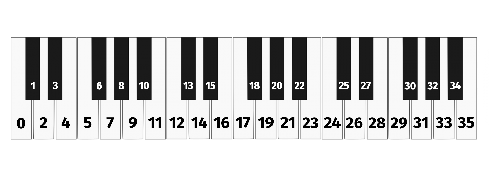
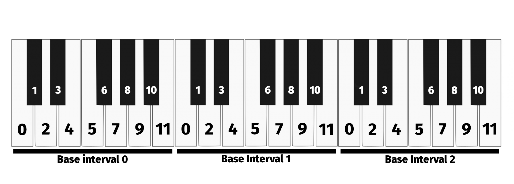

Quickstart
======================================

Installation
------------------------

Xenharmlib works with python 3.11 and beyond. We recommend using xenharmlib
in a `virtual environment <https://docs.python.org/3/library/venv.html>`_.
Xenharmlib can be installed with pip:

.. code-block:: console

   (.venv) $ pip install xenharmlib

Tunings and Pitches
------------------------

Xenharmlib offers a few basic components that serve as the building
blocks for deriving common tunings. The most widespread are tunings
with equal divisions of the octave
(:class:`~xenharmlib.core.tunings.EDOTuning`), which include the
standard contemporary Western tuning.

.. testcode::

   from xenharmlib import EDOTuning

   edo12 = EDOTuning(12)

EDO tunings are constructed by the number of divisions that exist in one
octave. A modern Arabic scale can for example be constructed like this:

.. testcode::

   edo24 = EDOTuning(24)

If you want a different interval than the octave for the equivalency
interval, for example a tritave, you can use the more general "equal
division tuning" :class:`~xenharmlib.core.tunings.EDTuning` (sans 'O').
There you can define the frequency ratio of the equivalency interval
yourself:

.. testcode::

   from xenharmlib import EDTuning
   from xenharmlib import FrequencyRatio

   bohlen_pierce = EDTuning(13, FrequencyRatio(3))

.. note::

   Xenharmlib offers a broad range of tuning contexts
   (among them :doc:`Prime Limit Tunings <primelimit_tunings>`
   and even fully user-defined
   :doc:`Regular Temperament Systems <multigen_tunings>`).
   For the introductory purpose of this Quickstart however we will focus
   purely on "equal division of the octave" tunings.

Xenharmlib is designed in a way that you can use different levels of
abstraction for individual tuning sounds. Some prefer the customary
world of notes (like D, F#) while others want to look at tunings more
mathematically, exploring pitches and pitch classes as integers
without the burdens of enharmonic ambiguity.

In the first part of this tutorial we want to look at the numerical
conceptual level of individual sounds, the pitch:

.. testcode::

   edo12 = EDOTuning(12)
   edo31 = EDOTuning(31)

   edo12_g0 = edo12.pitch(7)
   edo31_g0 = edo31.pitch(18)

A pitch is first and foremost defined by its pitch index. The pitch index
defines the number of steps from the base pitch, which is given the pitch
index of 0. To visualize pitch indices, best think of a piano: The pitch
index is the number of successive key presses needed to reach a tone
starting from the lowest C:

.. testcode::

   c0 = edo12.pitch(0)
   g0 = edo12.pitch(7)
   g1 = edo12.pitch(19)
   gsharp1 = edo12.pitch(20)

Pitches can be compared based on their frequency:

.. testcode::

   print(edo31.pitch(1) < edo12.pitch(1))
   print(edo31.pitch(1) > edo12.pitch(1))
   print(edo24.pitch(2) == edo12.pitch(1))

.. testoutput::

   True
   False
   True

This also means that pitches are sortable, even across different
tunings:

.. testcode::

    p1 = edo24.pitch(4)
    p2 = edo31.pitch(2)
    p3 = edo12.pitch(3)

    print(sorted([p1, p2, p3]))

.. testoutput::

    [EDOPitch(2, 31-EDO), EDOPitch(4, 24-EDO), EDOPitch(3, 12-EDO)]

To retrieve the frequency of a pitch directly use the frequency
property:

.. testcode::

    print(edo24.pitch(3).frequency)

.. testoutput::

    Frequency(55*2**(3/8)/4)

You might be wondering why you are not seeing a simple number but an
expression. This is because pitches in equal division tunings have
irrational frequencies. Xenharmlib does not round them to floats
but keeps them in a symbolic format to achieve perfect precision
results when doing mathematical operations. The above frequency
is equal to this expression:

.. math::

   55\frac{2^{\frac{3}{8}}}{4}

If you are fine with less precision you can always convert a frequency
to a float. (Just keep in mind that errors add up when doing floating
point math)

.. testcode::

    print(edo24.pitch(3).frequency.to_float())

.. testoutput::

    17.831543876451384

Pitches can be transformed into other pitches by transposition.
For this purpose pitch objects provide a
:meth:`~xenharmlib.core.pitch.Pitch.transpose` method that expects
a positive or negative integer (determining the pitch difference in
steps), or an interval object (more on that later).
The following snippets e.g. generates the circle of fifths for the
contemporary Western tuning.

.. testcode::

    def print_co5(start_pitch):
        for i in range(0, 12):
            # pitch difference for the fifth in the
            # Western equal temperament system is 7
            pitch = start_pitch.transpose(i * 7)
            print(pitch)

    # start with F0
    f0 = edo12.pitch(5)
    print_co5(f0)

.. testoutput::

    EDOPitch(5, 12-EDO)
    EDOPitch(12, 12-EDO)
    EDOPitch(19, 12-EDO)
    EDOPitch(26, 12-EDO)
    EDOPitch(33, 12-EDO)
    EDOPitch(40, 12-EDO)
    EDOPitch(47, 12-EDO)
    EDOPitch(54, 12-EDO)
    EDOPitch(61, 12-EDO)
    EDOPitch(68, 12-EDO)
    EDOPitch(75, 12-EDO)
    EDOPitch(82, 12-EDO)

Pitches of periodic tunings (for example the various equal temperaments)
form pitch classes (or in mathematical terms: equivalency classes in a
finite group). As a musician, you are already familiar with this in the
standard Western notation, since pitches of the same class get assigned
the same letter. For pitches of periodic tunings, the property
:attr:`~xenharmlib.core.pitch.PeriodicPitch.pc_index` can be used to
retrieve the pitch class, while the property
:attr:`~xenharmlib.core.pitch.PeriodicPitch.bi_index` returns the index
of the base interval.

.. testcode::

    g0 = edo12.pitch(7)
    g1 = edo12.pitch(19)
    
    print(g0.pc_index)
    print(g0.bi_index)

    print(g1.pc_index)
    print(g1.bi_index)

.. testoutput::

    7
    0
    7
    1

Pitches are bound to their tuning, but you can easily map pitches of
one tuning to another by the
:meth:`~xenharmlib.core.freq_repr.FreqRepr.retune_closest`
method. This takes the frequency of the pitch and finds the pitch with
the closest frequency in another tuning. For example if you are
accustomed to a standard western tuning and just started your journey
into microtonality you might be interested in finding the 12 pitches of a
western octave that you are already familiar with in a different system:

.. testcode::

    def western_pitches(tuning):
        pitches = []
        for i in range(0, 12):
            pitches.append(
                edo12.pitch(i).retune_closest(tuning)
            )
        return pitches

    pitches = western_pitches(edo31)
    for pitch in pitches:
        print(pitch)

.. testoutput::

    EDOPitch(0, 31-EDO)
    EDOPitch(3, 31-EDO)
    EDOPitch(5, 31-EDO)
    EDOPitch(8, 31-EDO)
    EDOPitch(10, 31-EDO)
    EDOPitch(13, 31-EDO)
    EDOPitch(15, 31-EDO)
    EDOPitch(18, 31-EDO)
    EDOPitch(21, 31-EDO)
    EDOPitch(23, 31-EDO)
    EDOPitch(26, 31-EDO)
    EDOPitch(28, 31-EDO)

Tunings also allow pitch approximations directly from frequencies
with the :meth:`~xenharmlib.core.tunings.OriginContext.closest_freq_repr`
method.

For example, if you want the pitch class that best approximates the
justly intonated G (defined as the result of multiplying the C0-pitch
by frequency ratio :math:`\frac{3}{2}`), you can do something like this:

.. testcode::

    from xenharmlib import FrequencyRatio

    def get_g_pc_index(tuning):
        zero_freq = tuning.zero_element.frequency
        ji_g = zero_freq * FrequencyRatio(3, 2)
        best_g = tuning.closest_freq_repr(ji_g)
        return best_g.pc_index

    print(get_g_pc_index(edo12))
    print(get_g_pc_index(edo31))

.. testoutput::

    7
    18

Pitch Intervals
------------------------

An interval denotes the *difference* between two pitches. Interval objects
can be created in multiple ways in xenharmlib:

Calling the :meth:`~xenharmlib.core.origin_context.OriginContext.interval`
method of the tuning with two pitches as arguments:

.. testcode::

    pitch_a = edo31.pitch(3)
    pitch_b = edo31.pitch(9)
    interval = edo31.interval(pitch_a, pitch_b)

    print(interval)

.. testoutput::

    EDOPitchInterval(6, 31-EDO)

Calling the :meth:`~xenharmlib.core.freq_repr.FreqRepr.interval` of a pitch with
another pitch as an argument:

.. testcode::

    pitch_a = edo31.pitch(3)
    pitch_b = edo31.pitch(9)
    pitch_a.interval(pitch_b)

    print(interval)

.. testoutput::

    EDOPitchInterval(6, 31-EDO)

or, finally, without defining any pitches, by specifying the desired
distance directly with the
:meth:`~xenharmlib.core.origin_context.OriginContext.diff_interval`
method of the tuning:

.. testcode::

    interval = edo31.diff_interval(6)
    print(interval)

.. testoutput::

    EDOPitchInterval(6, 31-EDO)

Intervals are considered **directional** in xenharmlib, which means
that the order of the pitches from which they are created is important.

.. testcode::

    pitch_a = edo31.pitch(3)
    pitch_b = edo31.pitch(9)
    interval = pitch_b.interval(pitch_a)

    print(interval.pitch_diff)

.. testoutput::

    -6

The direction of intervals can be normalized with the :code:`abs()`
function:

.. testcode::

    pitch_a = edo31.pitch(3)
    pitch_b = edo31.pitch(9)
    interval_u = pitch_a.interval(pitch_b)
    interval_d = pitch_b.interval(pitch_a)

    assert interval_u.pitch_diff != interval_d.pitch_diff
    assert abs(interval_u).pitch_diff == abs(interval_d).pitch_diff

Similar to pitches intervals are comparable and sortable, also across
different tunings. Intervals with a smaller frequency ratio are
considered smaller, and vice versa. For example, the fifth interval of
31-EDO is a bit smaller than the fifth interval of 12-EDO:

.. testcode::

    interval_fifth_edo12 = edo12.diff_interval(7)
    interval_fifth_edo31 = edo31.diff_interval(18)

    assert interval_fifth_edo31 < interval_fifth_edo12

You can also directly get the frequency ratio and the corresponding
cents value:

.. testcode::

    interval_fifth_edo31.frequency_ratio
    interval_fifth_edo31.cents

There is a bit of a caveat when handling negative / descending intervals:
The :code:`<` operator does compare frequency ratios, *not* absolute
sizes, so - maybe surprising to some - the following holds:

.. testcode::

    descending_fifth = edo12.pitch(7).interval(
        edo12.pitch(0)
    )
    descending_second = edo12.pitch(2).interval(
        edo12.pitch(0)
    )
    assert descending_fifth < descending_second

If you want to compare absolute sizes you have to use the :code:`abs()`
function.

.. testcode::

    assert abs(descending_fifth) > abs(descending_second)

Futhermore since interval objects define the difference between two pitches
they can also be used as an argument for transposition:

.. testcode::

   fifth = edo12.diff_interval(7)
   D = edo12.pitch(2)

   print(D.transpose(fifth))

.. testoutput::

   EDOPitch(9, 12-EDO)

Intervals additionally implement a full arithmetic:

.. testcode::

   fifth = edo12.diff_interval(7)
   fourth = edo12.diff_interval(5)

   print(fifth - fourth) # major second
   print(fifth + fourth) # octave
   print(2 * fifth) # major ninth

.. testoutput::

   EDOPitchInterval(2, 12-EDO)
   EDOPitchInterval(12, 12-EDO)
   EDOPitchInterval(14, 12-EDO)

Pitch Scales
------------------------

Pitch scales are sorted lists of unique pitches. Like other objects,
they can be constructed using builder methods in the tuning object.

The :meth:`~xenharmlib.core.origin_context.OriginContext.scale` method
constructs a scale object from a list of pitches:

.. testcode::

    scale = edo31.scale(
        [edo31.pitch(9), edo31.pitch(0), edo31.pitch(4), edo31.pitch(5)]
    )

Xenharmlib will sort the pitches automatically when constructing a
scale, so the original order is not important. The uniqueness property
means that duplicate pitches in the list will be only added once.

A more concise method to construct a pitch scale is to use the
the :meth:`~xenharmlib.core.tunings.TuningABC.index_scale`
method that expects a list of integers instead of a list of pitches.
The following expression is equivalent to the above snippet:

.. testcode::

    scale = edo31.index_scale([9, 10, 4, 5])

Please note that the uniqueness property refers to pitch and not pitch
class, so scales including 'C-0' and 'C-1' are possible.
Even though the familiar textbook definition of a scale is "a consecutive
series of notes that form a progression between one note and its octave",
having a looser definition of a scale has considerable advantages: It
allows to define scales on tunings that might not have an octave (for
example the Bohlen-Pierce tuning) or even tunings that do not have an
equivalency interval at all. Furthermore this way there is no need for
a distinct chord object in xenharmlib, because both chords and scales
fulfill the definition of "a sorted list of unique pitches" with scales
being sorted from left to right, while chords being sorted from bottom
to top. For example a 9th chord can be defined as a scale object like
this:

.. testcode::

    Cmaj9 = edo31.index_scale([0, 4, 7, 11, 14])

Scale objects support most of the typical list operations, e.g.
they are iterable:

.. testcode::

    scale = edo31.index_scale([0, 4, 5, 9, 10])

    for pitch in scale:
        print(pitch)

.. testoutput::

    EDOPitch(0, 31-EDO)
    EDOPitch(4, 31-EDO)
    EDOPitch(5, 31-EDO)
    EDOPitch(9, 31-EDO)
    EDOPitch(10, 31-EDO)

They also support item selection and slicing:

.. testcode::

    print(scale[1])
    print(scale[1:-1])

.. testoutput::

    EDOPitch(4, 31-EDO)
    EDOPitchScale([4, 5, 9], 31-EDO)

The 'in' operator accepts both pitches and pitch intervals. If an
interval is given xenharmlib checks if *any* two pairs of notes
(both in descending and ascending direction) form the interval.

.. testcode::

    scale = edo31.index_scale([0, 5, 9])
    pitch = edo31.pitch(0)
    interval = edo31.diff_interval(9)

    assert pitch in scale
    assert interval in scale

The in operator is even more broad: It generally accepts every object
that has a :attr:`frequency` or a :attr:`frequency_ratio` attribute,
meaning that pitch and interval containment can be tested across
tunings:

.. testcode::

    edo12_scale = edo12.scale(edo12.pitch_range(0, 12))
    edo24_scale = edo24.scale(edo24.pitch_range(0, 24))

    assert all([pitch in edo24_scale for pitch in edo12_scale])

    edo12_fifth = edo12.diff_interval(7)
    assert edo12_fifth in edo24_scale

In general, all the operations that are possible on single pitches are
also possible on scales, for example, you can transpose a scale the
same way you can transpose pitches:

.. testcode::
   
    scale = edo31.index_scale([0, 5, 9])
    transposed = scale.transpose(2)
    print(transposed)

.. testoutput::

    EDOPitchScale([2, 7, 11], 31-EDO)

You can also use retuning to approximate a scale in a different
tuning:

.. testcode::

    scale = edo12.index_scale([0, 1, 2])
    retuned = scale.retune_closest(edo24)
    print(retuned)

.. testoutput::

    EDOPitchScale([0, 2, 4], 24-EDO)

Scales in periodic tunings can be rotated upwards and downwards. On
upward rotation the lowest pitch will get transposed by the tuning's
equivalency interval until it surpasses the highest pitch of the scale.
On downwards rotation vice versa: The highest pitch is transposed
downwards until it is below the lowest pitch.

In the context of chords this is called *inversion*. In the context
of scales this is also known as *mode*. Since both terms have very
contextual meanings we decided for the more neutral *rotation* as
a name.

Let's look at it in the context of triads:

.. testcode::

    c0 = edo12.pitch(0)
    e0 = edo12.pitch(4)
    g0 = edo12.pitch(7)

    c_triad = edo12.scale([c0, e0, g0])

We can use the :meth:`~xenharmlib.core.scale.PeriodicScale.rotated_up` method
to receive the first inversion of the triad:

.. testcode::

    c_first_inversion = c_triad.rotated_up()
    print(c_first_inversion)

.. testoutput::

    EDOPitchScale([4, 7, 12], 12-EDO)

while :meth:`~xenharmlib.core.scale.PeriodicScale.rotated_down` on the other
hand can be used to do the opposite, making us return to where we started:

.. testcode::

    assert c_first_inversion.rotated_down() == c_triad

There is also the more general method
:meth:`~xenharmlib.core.scale.PeriodicScale.rotation` at your disposal,
which can be used as a shortcut if you want more than one upward or
downward rotation:

.. testcode::

    second_inversion = c_triad.rotation(2)
    print(second_inversion)

.. testoutput::

    EDOPitchScale([7, 12, 16], 12-EDO)

Pitch scales also support most of the typical set operations that
you are familiar with from the builtin python sets (with slightly
different names):

* :meth:`~xenharmlib.core.scale.PeriodicScale.intersection`
* :meth:`~xenharmlib.core.scale.Scale.union`
* :meth:`~xenharmlib.core.scale.PeriodicScale.difference`
* :meth:`~xenharmlib.core.scale.PeriodicScale.symmetric_difference`
* :meth:`~xenharmlib.core.scale.PeriodicScale.is_subset`
* :meth:`~xenharmlib.core.scale.PeriodicScale.is_superset`
* :meth:`~xenharmlib.core.scale.PeriodicScale.is_disjoint`

As an illustration of the usefulness of set operations we calculate
pitches safe for improvisation according to the 'avoid notes' concept in
jazz for 12-EDO. There are various approaches (and a lot of dispute) to
this, but one rule-of-thumb is that for any chord and a selected scale,
pitches in the scale that are one degree over a chord pitch should be
avoided:

.. testcode::

    def get_safe_for_chord(scale, chord):

        # get a scale consisting of the bad pitches
        avoid_scale = chord.transpose(1)

        # get the original scale without the bad pitches
        # (the ignore_bi_index=True tells the operation
        # to also remove equivalent pitches that just
        # differ in base interval)
        return scale.difference(avoid_scale, ignore_bi_index=True)

    c_maj = edo12.index_scale([0, 2, 4, 5, 7, 9, 11])
    F7 = edo12.index_scale([5, 9, 12, 15])

    print(get_safe_for_chord(c_maj, F7))

.. testoutput::

    EDOPitchScale([0, 2, 5, 7, 9, 11], 12-EDO)

As an example for the intersection method we calculate how the Revati
scale from India's Carnatic music and the Japanese Hirajōshi scale (as
interpreted by Sachs and Slonimsky) overlap when being translated into
the Western equal-tempered 12-tone system:

.. testcode::

    revati = edo12.index_scale([0, 1, 5, 7, 10])
    hirajoshi = edo12.index_scale([0, 1, 5, 6, 10])
    print(revati.intersection(hirajoshi))

.. testoutput::

    EDOPitchScale([0, 1, 5, 10], 12-EDO)

Similar to python's sets there are also infix-operations available
for scales:

.. testcode::

    print(revati | hirajoshi) # union
    print(revati & hirajoshi) # intersection
    print(revati - hirajoshi) # difference
    print(revati ^ hirajoshi) # symmetric difference

.. testoutput::

    EDOPitchScale([0, 1, 5, 6, 7, 10], 12-EDO)
    EDOPitchScale([0, 1, 5, 10], 12-EDO)
    EDOPitchScale([7], 12-EDO)
    EDOPitchScale([6, 7], 12-EDO)

Often the interest lies not in the overlapping of specific pitches, but
rather in the shared pitch classes. This becomes particularly relevant
when choosing notes for a melody during key modulation.
To aid in this task, scales of periodic tunings can be normalized to
the first base interval. As a result, pitch indices and pitch class
indices become the same, simplifying the analysis for a variety of
purposes.

.. testcode::

    a_minor = edo12.index_scale([9, 11, 12, 14, 16, 17, 19])
    print(a_minor.pcs_normalized())

.. testoutput::

    EDOPitchScale([0, 2, 4, 5, 7, 9, 11], 12-EDO)

(Please note that this method does not maintain the original order of
the scale. As illustrated in the example, both A minor and C major
possess the exact same base interval normal form.)

After scales are converted into their pitch class set normal form, they
can be treated like sets of pitch classes. To address our original
question about which notes to use when modulating from one key to
another, we can now combine basic interval normalization with the
intersection method to achieve our goal:

.. testcode::

    a_minor = edo12.index_scale([9, 11, 12, 14, 16, 17, 19])
    g_major = edo12.index_scale([7, 9, 11, 12, 14, 16, 18])

    shared = a_minor.pcs_normalized().intersection(
        g_major.pcs_normalized()
    )
    print(shared)

.. testoutput::

    EDOPitchScale([0, 2, 4, 7, 9, 11], 12-EDO)

Given the frequent need of this operation, a convenient shortcut is also
available:

.. testcode::

    shared = a_minor.pcs_intersection(g_major)
    print(shared)

.. testoutput::
    :hide:

    EDOPitchScale([0, 2, 4, 7, 9, 11], 12-EDO)

Pitch scale objects have many features, too many to list them all in the
Quickstart. If you want to know more about scale features head over to
the API documentation on the :mod:`~xenharmlib.core.pitch_scale` module.

Notation
---------------------------------

Notation can be a murky thing, especially when it comes to tunings that
are more novel and don't come with an established cultural tradition.
Not every notation system makes sense for every tuning. In this Quickstart
we will focus on a notation called UpDownNotation which is a superset
of the standard Western notation and is designed as a general notation
for "equal division of the octave" tunings.

UpDownNotation first approximates the western naturals (C, D, E, F,
G, A, B), mapping C to the zero pitch and generating the other
naturals by stacking fifths. After that, it approximates sharp
and flat accidentals and fills the gaps with multiples of
sharps and flats or up and down arrows.

Let's create a notation for the Modern Arabic quartertone tuning
with it:

.. testcode::

    from xenharmlib import EDOTuning
    from xenharmlib import UpDownNotation

    edo24 = EDOTuning(24)
    n_edo24 = UpDownNotation(edo24)

The notation layer 'wraps' the low level classes and provides a more
human-friendly interface to them, making connections between
pitches of different tunings visible that are sometimes hard to see
when only represented as integers.

Like the tuning object on the lower level, the notation object provides
us with builder methods to create notes, intervals, and scales.

Individual notes can be created by using the note method which expects
a pitch class symbol and the base interval index (the octave number in
EDOs) as arguments:

.. testcode::

    c = n_edo24.note('C', 0)
    e_neutral = n_edo24.note('vE', 0)
    g_flat = n_edo24.note('Gb', 0)

You can combine two notes to form a note interval:

.. testcode::

    neutral_3 = n_edo24.interval(c, e_neutral)
    diminished_5 = n_edo24.interval(c, g_flat)

A list of notes can be used to create a note scale:

.. testcode::

    triad = n_edo24.scale([c, e_neutral, g_flat])

Please note that other notations might use different builder arguments
to create these objects, however the above combination are the most
common practice.

All notational objects are bound to their lower-level equivalent.
Given a notational object you can always retrieve their lower level
counterpart:

.. testcode::

    print(c.pitch)
    print(neutral_3.pitch_interval)
    print(triad.pitch_scale)

.. testoutput::

    EDOPitch(0, 24-EDO)
    EDOPitchInterval(7, 24-EDO)
    EDOPitchScale([0, 7, 12], 24-EDO)

Notes
-----------------------------------

The type of notes in a notation is heavily dependent on the attributes
of the tuning it encloses. Tunings with many divisions of the octave
need more notes than tunings with fewer divisions. In certain notations
'C#' and 'Db' refer to the same pitch, in others the pitches are
distinct.

Note objects created by UpDownNotation consists of a natural (like 'C')
and an accidental (like '#'). A Down-Arrow :code:`v` means
"transpose the note one pitch down", an Up-Arrow :code:`^`
means "transpose the note one pitch up". By convention
Up-Arrows and Down-Arrows are put *before* the natural while
sharps (:code:`#`), flats (:code:`b`), double-sharps (:code:`x`)
are put behind it.

.. testcode::

    # A C sharp transposed one pitch down, resulting in
    # the quartertone that lays between C and C#
    note = n_edo24.note('vC#', 0)

In xenharmlib's implementation of UpDownNotation, enharmonic equivalents
are theoretically infinite due to its comprehensive accidental
arithmetic. Though rarely used in composition, this feature allows for
the creation of notes with any number of accidentals:

.. testcode::

    weird_aug_c0 = n_edo24.note('^^^^Cx#', 0)
    weird_dim_c1 = n_edo24.note('vvvvCbbbbb', 1)
    print(weird_aug_c0 == weird_dim_c1)

.. testoutput::

    True

It is even possible to mix flat/sharp and up/down accidentals:

.. testcode::

    weird_note = n_edo24.note('vvvvv^^^^Cxx#xxbbx', 0)

If a certain accidental is available depends on the underlying tuning.
For 12-EDO e.g. the 'v' accidental is not available, however for 31-EDO
it is. In general, there exists exactly one accidental symbol for each
accidental value (hence 'v' does not exist in 12-EDO because it would be
the same as 'b')

Since notes are wrappers around pitches, you can operate on notes mostly
the same way you operated on pitches with the difference that the
methods returning pitches now return notes. We will quickly go through
the similarities.

Notes are sortable and comparable by frequencies the same way as
pitches:

.. testcode::

    edo31 = EDOTuning(31)
    n_edo31 = UpDownNotation(edo31)

    assert n_edo31.note('^G', 0) < n_edo31.note('G#', 0)
    assert n_edo31.note('Dx', 0) > n_edo31.note('D#', 0)
    assert n_edo31.note('G', 0) == n_edo31.note('G', 0)

    edo12 = EDOTuning(12)
    n_edo12 = UpDownNotation(edo12)

    assert n_edo12.note('G', 0) != n_edo31.note('G', 0)
    assert n_edo12.note('G', 0) > n_edo31.note('G', 0)

Notes and pitches can also be compared:

.. testcode::

    assert n_edo31.note('vG', 0) < edo31.pitch(18)
    assert n_edo31.note('G', 0) == edo31.pitch(18)

The reason for this is that notes and pitches implement a common
interface. Notes have convenient 'proxies' to the properties of the
underlying pitch. This way pitch objects can be substituted for notes
in all analytical utils of the library.

Here is a selection of the shared interface between periodic pitches
and periodic notes:

.. testcode::

    gsharp1 = n_edo31.note('G#', 1)
    assert gsharp1.frequency == gsharp1.pitch.frequency
    assert gsharp1.pitch_index == gsharp1.pitch.pitch_index
    assert gsharp1.pc_index == gsharp1.pitch.pc_index
    assert gsharp1.bi_index == gsharp1.pitch.bi_index

Because the equality sign tests on frequency it does *not* care for
enharmonic differences. If you want to be stricter and only consider
two notes equal if they are functionally equal you can use the
:meth:`~xenharmlib.core.note.NatAccNote.is_notated_same` method:

.. testcode::

    assert n_edo12.note('D#', 0) == n_edo12.note('Eb', 0)

    assert not n_edo12.note('D#', 0).is_notated_same(
        n_edo12.note('Eb', 0)
    )

Notes have an interval method returning a note interval:

.. testcode::

    csharp1 = n_edo31.note('C#', 1)
    gsharp1 = n_edo31.note('G#', 1)
    gsharp1.interval(gsharp1)

Notes can be transposed through the transpose method by giving a
note interval of the same notation:

.. testcode::

    c0 = n_edo12.note('C', 0)
    g0 = n_edo12.note('G', 0)
    P5 = n_edo12.shorthand_interval('P', 5)

    assert g0 == c0.transpose(c0.interval(g0))
    assert g0 == c0.transpose(P5)

Notes of UpDownNotation have additional properties that they share
with all Notes from natural/accidental notations that pertain to
their 'split' definition. For example, each note can be inspected
regarding its natural and accidental fragments.

For example, observe the difference in using the
:attr:`~xenharmlib.core.notes.PeriodicNoteABC.pc_index`
property and the
:attr:`~xenharmlib.core.notes.NatAccNote.nat_pc_index`
("natural pitch class index") property:

.. testcode::

    edo12_bsharp = n_edo12.note('B#', 0)
    print(edo12_bsharp.pc_index)
    print(edo12_bsharp.nat_pc_index)

.. testoutput::

    0
    11

The pitch class index of the note is 0 because the note refers to the
pitch index 12, which has pitch class 0 (the pitch class of 'C').
In the notation context however it is seen as a 'B' with an accidental
and 'B' has pitch class 11.

You can see a similar effect when looking at the base interval index.
On natural/accidental notes it too comes in two flavors: One for the
actual pitch and one for the pitch of the natural:

.. testcode::

    edo12_bsharp = n_edo12.note('B#', 0)
    print(edo12_bsharp.bi_index)
    print(edo12_bsharp.nat_bi_index)

.. testoutput::

    1
    0

If you were paying close attention, you might have noticed that we
used 0 instead of 1 as the base interval when defining our note.
This convention of using the base interval index of the natural pitch,
rather than the actual pitch, is quite common, as seen in scientific
pitch notation, which forms the basis of xenharmlib's implementation.
You've probably grown so accustomed to it that you didn't even realize
until now.

Let's look at the accidentals: In general they signify a deviation
from a natural pitch, in UpDownNotation they signify a deviation
*in steps* from the natural pitch. You are probably familiar with
this from the traditional Western system:

.. testcode::

    d_sharp = n_edo12.note('D#', 0)
    d_flat = n_edo12.note('Db', 0)

    print(d_sharp.acc_value)
    print(d_flat.acc_value)

.. testoutput::

    1
    -1

As expected the '#' symbol raises the note by one step, while the
'b' symbol flattens it by one step. Let's look at this in another
tuning:

.. testcode::

    d_sharp = n_edo31.note('D#', 0)
    d_flat = n_edo31.note('Db', 0)

    print(d_sharp.acc_value)
    print(d_flat.acc_value)

.. testoutput::

    2
    -2

What happened here? In 31-EDO, a step is much smaller compared to the
traditional 12-EDO Western tuning. If we were to map sharps and flats
to just one step in 31-EDO, it would deviate from the expected sound
too much, making it difficult to maintain a (somewhat) consistent
meaning for flats and sharps across different microtonal tunings.
The measure of the size of sharps and flats in EDO tunings is known as
"sharpness," and while 12-EDO has a sharpness of 1, 31-EDO has a
sharpness of 2. To move to the next pitch (upwards or downwards) in
31-EDO, one must use different accidentals:

.. testcode::

    d_up = n_edo31.note('^D', 0)
    d_down = n_edo31.note('vD', 0)

    print(d_up.acc_value)
    print(d_down.acc_value)

.. testoutput::

    1
    -1

Sometimes you also want to examine notes in regards to their symbols.
For this purpose, natural/accidental notations like UpDownNotation have
three properties: One for the pitch class symbol, one for the natural
class symbol, and one for the accidental:

.. testcode::

    print(n_edo31.note('^B#', 0).pc_symbol)
    print(n_edo31.note('^B#', 0).natc_symbol)
    print(n_edo31.note('^B#', 0).acc_symbol)

.. testoutput::

    ^B#
    B 
    ^#

Naturals have their own index system that is closely related
to the 'Roman numeral system' but starting from 0 instead of 1.
In western piano terms: The natural index of a note is the number
of successive *white* key presses from the first natural to the
note while ignoring the accidental of the note:

.. testcode::

    print(n_edo31.note('D', 0).nat_index)
    print(n_edo31.note('D#', 1).nat_index)

.. testoutput::

    1
    8

You can see the relation to the roman numeral system easily when
you think of the way one traditionally calls the intervals from
C-0 to each note in the western system: The interval to the first note
in the example is called a major *second* while the interval to the
second one is called an augmented *ninth*.

Similar to pitch class indices there are also natural class indices.
The natural class index is a measure for when you want to ignore
base intervals and just look at the equivalency of naturals:

.. testcode::

    print(n_edo31.note('D', 0).natc_index)
    print(n_edo31.note('D#', 1).natc_index)
    print(n_edo31.note('vG', 1).natc_index)

.. testoutput::

    1
    1
    4

It follows from the definition that notes with the same natural symbol
also have the same natural class index (as you can see with D-0, D#-1)
Natural class indices are especially useful when you are examining
compound intervals since they characterize the remainder in terms
of natural indices: An augmented *ninth* is only an augmented
*second* transposed one octave. 

Note Intervals
-----------------------------------

Today's common Western interval notation is shaped by pretty old ideas
and has been handed down as a tradition for centuries without impactful
revisitation from a modern eye. Even though every new generation of
musicians struggles to understand the minute differences of perfect and
imperfect intervals the system is so deeply ingrained in Western
harmonic analysis and composition that it is likely to stay for the
foreseeable future.

Fortunately xenharmlib's implementation of UpDownNotation takes a lot of
work from you when it comes to interval naming while also trying to
provide an interface that is more consistent in terms of mathematical
definitions.

When creating a note interval UpDownNotation automatically generates the
appropriate shorthand interval name:

.. testcode::

    edo31 = EDOTuning(31)
    n_edo31 = UpDownNotation(edo31)

    interval = n_edo31.interval(
        n_edo31.note('C', 0),
        n_edo31.note('G#', 0)
    )

    print(interval.shorthand_name)

.. testoutput::

    ('A', 5)

As an alternative to the notation builder method, you can also use the
interval method of the Note object:

.. testcode::

    interval = n_edo31.note('C', 0).interval(
        n_edo31.note('^Ab', 0)
    )
    print(interval.shorthand_name) 

.. testoutput::

    ('^m', 6)

UpDownNotation also provides a builder method to create intervals
directly from their shorthand name:

.. testcode::

    P5 = n_edo12.shorthand_interval('P', 5)
    b0 = n_edo12.note('B', 0)
    print(b0.transpose(P5))

.. testoutput::

    UpDownNote(F#, 1, 12-EDO)

Note intervals are comparable and sortable by their frequency ratio:

.. testcode::

    edo12 = EDOTuning(12)
    n_edo12 = UpDownNotation(edo12)

    P4 = n_edo12.shorthand_interval('P', 4)
    A5 = n_edo12.shorthand_interval('A', 5)
    m6 = n_edo12.shorthand_interval('m', 6)

    assert P4 < A5
    assert A5 == m6

    edo31 = EDOTuning(31)
    n_edo31 = UpDownNotation(edo31)

    P5_12 = n_edo12.shorthand_interval('P', 5)
    P5_31 = n_edo31.shorthand_interval('P', 5)
    
    assert P5_31 < P5_12

Interval sortability can come in handy, for example, if you want to sort
different EDOs according to the width of their fifth:

.. testcode::

    edos = [EDOTuning(n) for n in [12, 24, 31, 53]]
    n_edos = [UpDownNotation(e) for e in edos]

    sorted_n_edos = sorted(
        n_edos,
        key=lambda n_edo: n_edo.shorthand_interval('P', 5)
    )

    for n_edo in sorted_n_edos:
        print(n_edo, n_edo.shorthand_interval('P', 5).cents)

.. testoutput::

    UpDownNotation(31-EDO) 696.7741935484
    UpDownNotation(12-EDO) 700.0
    UpDownNotation(24-EDO) 700.0
    UpDownNotation(53-EDO) 701.8867924528

You can also compare note intervals and pitch intervals:

.. testcode::

    P5_31 = n_edo31.shorthand_interval('P', 5)
    
    assert P5_31 < edo12.interval(
        edo12.pitch(0), edo12.pitch(7)
    )

Note intervals and pitch intervals expose the same basic properties,
so the object types can be used interchangeably in many cases. Here
is a short overview:

.. testcode::

    m3 = n_edo31.shorthand_interval('m', 3)
    assert m3.frequency_ratio == m3.pitch_interval.frequency_ratio
    assert m3.cents == m3.pitch_interval.cents
    assert m3.pitch_diff == m3.pitch_interval.pitch_diff

Like pitch with intervals xenharmlib's note intervals have *directions*.
This is necessary so the transpose method of the Note object is well defined:

.. testcode::

    a = n_edo31.note('A', 1)
    c = n_edo31.note('C', 1)
    interval = a.interval(c)
    assert a.transpose(interval) == c

If intervals have a descending direction their naming changes accordingly.
The constructed interval above is a descending major 6:

.. testcode::

    print(interval.shorthand_name)
    
.. testoutput::

    ('M', -6)

Please note that this is something entirely different than inverting the
interval:

.. testcode::

    a = n_edo31.note('A', 0)
    c = n_edo31.note('C', 1)
    interval = a.interval(c)
    print(interval.shorthand_name)
    
.. testoutput::

    ('m', 3)

Note intervals also implement the :func:`abs` function, so descending
intervals can be transformed into their ascending counterpart:

.. testcode::

    g0 = n_edo31.note('G', 0)
    c1 = n_edo31.note('C', 1)
    interval = c1.interval(g0)

    print(interval.shorthand_name)
    print(abs(interval).shorthand_name)
    
.. testoutput::

    ('P', -4)
    ('P', 4)

Intervals implement a full arithmetic that is also harmonic function aware:

.. testcode::

   m3 = n_edo31.shorthand_interval('m', 3)
   M3 = n_edo31.shorthand_interval('M', 3)

   print(M3 + m3)
   print(M3 - m3)
   print(2 * M3)

.. testoutput::

   UpDownNoteInterval(P, 5, 31-EDO)
   UpDownNoteInterval(A, 1, 31-EDO)
   UpDownNoteInterval(A, 5, 31-EDO)

Note Scales
-----------------------------------

A set of unique, ordered notes is called a note scale. Note scales can
be created with the :meth:`~xenharmlib.core.origin_context.OriginContext.scale`
method of the notation context that expects a list of notes originating
from the same notation:

.. testcode::

    Cm7 = n_edo12.scale(
        [n_edo12.note(s, 0) for s in ['C', 'Eb', 'G', 'Bb']]
    )

Or - in a more concise form - with the
:meth:`~xenharmlib.core.notation.NatAccNotation.pc_scale` method
that expects a list of pitch class symbols:

.. testcode::

    Cm7 = n_edo12.pc_scale(['C', 'Eb', 'G', 'Bb'])

In terms of list operations note scales provide the same functionality
as pitch scales. Single notes and slices can be retrieved as if the
scale object was a python builtin list. The in operator works likewise
both with pitches, pitch intervals, notes, and note intervals.

.. testcode::

    print(Cm7[1])
    print(Cm7[0:3])

    assert n_edo12.note('C', 0) in Cm7
    assert n_edo12.shorthand_interval('m', 3) in Cm7
    assert edo12.pitch(3) in Cm7
    assert edo12.diff_interval(10) in Cm7
    
.. testoutput::

    UpDownNote(Eb, 0, 12-EDO)
    UpDownNoteScale([C0, Eb0, G0], 12-EDO)

Scale comparisons work based on note frequencies, so using the
equal sign will ignore enharmonic notation differences:

.. testcode::

    Cm = n_edo12.pc_scale(['C', 'Eb', 'G'])
    Cm_weird = n_edo12.pc_scale(['C', 'D#', 'Abb'])

    assert Cm == Cm_weird

If you want to test equality *on the notation level* (ignoring
enharmonic equivalencies) you have to use the
:meth:`~xenharmlib.core.note_scale.NoteScale.is_notated_same`
method:

.. testcode::

    assert Cm.is_notated_same(Cm)
    assert not Cm.is_notated_same(Cm_weird)

You may be familiar with the method from the Note section. In fact, a
lot of operations on single notes work on scales as well. This is
especially powerful when you want to transpose scales:

.. testcode::

    M7 = n_edo12.shorthand_interval('M', 7)
    Bm7 = Cm7.transpose(M7)
    print(Bm7)

.. testoutput::

    UpDownNoteScale([B0, D1, F#1, A1], 12-EDO)

Scales support rotation which can be useful if you want to explore
different ways to play a chord or alter the mode of a scale.

.. testcode::

    Cm7_G = Cm7.rotation(2)
    print(Cm7_G)

.. testoutput::

    UpDownNoteScale([G0, Bb0, C1, Eb1], 12-EDO)

In the context of natural/accidental notations you can use the
:meth:`~xenharmlib.core.notation.NatAccNotation.natural_scale` method
to generate a scale consisting of only the naturals in a base interval.
(In UpDownNotation this is simply the C-Major Scale). Together with the
:meth:`~xenharmlib.core.scale.PeriodicScale.rotation` method
you can then generate the Gregorian Modes:

.. testcode::

    c_maj = n_edo12.natural_scale()

    print('ionian    ', c_maj)
    print('dorian    ', c_maj.rotation(1))
    print('phrygian  ', c_maj.rotation(2))
    print('lydian    ', c_maj.rotation(3))
    print('mixolydian', c_maj.rotation(4))
    print('aeolian   ', c_maj.rotation(5))

.. testoutput::

    ionian     UpDownNoteScale([C0, D0, E0, F0, G0, A0, B0], 12-EDO)
    dorian     UpDownNoteScale([D0, E0, F0, G0, A0, B0, C1], 12-EDO)
    phrygian   UpDownNoteScale([E0, F0, G0, A0, B0, C1, D1], 12-EDO)
    lydian     UpDownNoteScale([F0, G0, A0, B0, C1, D1, E1], 12-EDO)
    mixolydian UpDownNoteScale([G0, A0, B0, C1, D1, E1, F1], 12-EDO)
    aeolian    UpDownNoteScale([A0, B0, C1, D1, E1, F1, G1], 12-EDO)

Scales can be normalized to the first base interval which makes it
possible to compare scales on the level of tonal equivalencies:

.. testcode::

    c_maj = n_edo12.natural_scale(bi_index=1)
    a_min = c_maj.rotation(-2)

    norm_c_maj = c_maj.pcs_normalized()
    norm_a_min = a_min.pcs_normalized()
    assert norm_c_maj == norm_a_min

Note scales can be treated as sets. They support the union, intersection,
difference and symmetric difference operations as well as subset,
superset, and is_disjoint relationship tests.

As an illustration for set operations, we want to make a deep dive into
John Coltrane's *Giant Steps* and find out why it is regarded as one
of the most difficult jazz works for improvisation.

Coltrane's composition is based on fast harmonic changes between the
scales B major (on chords B7, F#7, C#m7), G major (on chords G7, D7,
Am7), and Eb major (on chords Eb7, Bb7, Fm7). We want to know the notes
playable for improvisation in each of the three sections.

Initially, we'll construct the three major scales. To do this, we'll
start from a C major scale, which has the appropriate structure but the
incorrect key. Then, we'll transpose it to generate each of our desired
three scales. (Though we could define every scale explicitly, noting all
the notes, this approach is simpler and more elegant.)

.. testcode::

    C_maj = n_edo12.natural_scale()

    # make a shortcut for interval builder
    # method so we have less visual noise
    sh = n_edo12.shorthand_interval

    B_maj = C_maj.transpose(sh('M', 7))
    G_maj = C_maj.transpose(sh('P', 5))
    Eb_maj = C_maj.transpose(sh('m', 3))

We'll create the chords in a similar manner. There are just two types:
major dominant 7 and minor dominant 7. We'll define each type in C, then
transpose to obtain each chord.

.. testcode::

    C7 = n_edo12.pc_scale(['C', 'E', 'G', 'Bb'])
    Cm7 = n_edo12.pc_scale(['C', 'Eb', 'G', 'Bb'])

    # to be played with B major
    B7 = C7.transpose(sh('M', 7))
    Fsharp_7 = C7.transpose(sh('A', 4))
    Csharp_m7 = Cm7.transpose(sh('A', 1))

    # to be played with G major
    G7 = C7.transpose(sh('P', 5))
    D7 = C7.transpose(sh('M', 2))
    Am7 = Cm7.transpose(sh('M', 6))

    # to be played with Eb major
    Eb7 = C7.transpose(sh('m', 3))
    Bb7 = C7.transpose(sh('m', 7))
    Fm7 = Cm7.transpose(sh('P', 4))

We're going to follow a common practice for improvising over chords with
scales: we avoid using scale notes that clash with the chord tones by a
minor second. To do this, we'll use the scale's
:meth:`~xenharmlib.core.scale.PeriodicScale.difference`
operation to filter them out.

.. testcode::

    def remove_avoid_notes(scale, chords):
        for chord in chords:
            avoid_scale = chord.transpose(sh('m',2))
            scale = scale.difference(
                avoid_scale, 
                ignore_bi_index=True
            )
        return scale

    # these three scales should be safe to play
    # on each of the respective chord sections

    B_maj_safe = remove_avoid_notes(B_maj, [B7, Fsharp_7, Csharp_m7])
    G_maj_safe = remove_avoid_notes(G_maj, [G7, D7, Am7])
    Eb_maj_safe = remove_avoid_notes(Eb_maj, [Eb7, Bb7, Fm7])

    print(B_maj_safe)
    print(G_maj_safe)
    print(Eb_maj_safe)

.. testoutput::

    UpDownNoteScale([C#1, D#1, F#1, G#1], 12-EDO)
    UpDownNoteScale([A0, B0, D1, E1], 12-EDO)
    UpDownNoteScale([F0, G0, Bb0, C1], 12-EDO)

We aim to determine if the improvisation scales have any notes in
common, indicating if there are notes we can play safely across two
consecutive sections. To test this, we're using the
:meth:`~xenharmlib.core.scale.PeriodicScale.is_disjoint`
method with the :code:`ignore_bi_index` flag set to True, treating notes
that differ only by the base interval as the same:

.. testcode::

    print(B_maj_safe.is_disjoint(G_maj_safe, ignore_bi_index=True))
    print(B_maj_safe.is_disjoint(Eb_maj_safe, ignore_bi_index=True))
    print(Eb_maj_safe.is_disjoint(G_maj_safe, ignore_bi_index=True))

.. testoutput::

    True
    True
    True

As it turns out *none* of the improvisation scales have common notes
with any of the others, meaning the player has to change to a completely
different set of tones on each scale change.  

The mathematical beauty of Coltrane's composition becomes even more
apparent when we toss all the notes from the improvisation scales
together by utilizing the
:meth:`~xenharmlib.core.scale.Scale.union`
operator.

.. testcode::

    all_notes = B_maj_safe.union(G_maj_safe).union(Eb_maj_safe)
    norm = all_notes.pcs_normalized()
    print(norm)
    print(len(norm))

.. testoutput::

    UpDownNoteScale([C0, C#0, D0, D#0, E0, F0, F#0, G0, G#0, A0, Bb0, B0], 12-EDO)
    12

The set of improvisation notes over all sections is simply the full
chromatic scale, meaning that the three improvisation scales cut the
chromatic scale in 3 disjoint sets, each with 4 notes.

Playing and Exporting
-----------------------------------

Sound synthesis and score composition are out of xenharmlib's scope,
however there are ways of hearing the things that you are building.

You can export xenharmlib objects into various formats and even play
a sine wave audio from the console to get a feeling for the sound of
scales, chords and single notes. Sine wave sounds can be played on Mac,
Linux and Windows using the :func:`~xenharmlib.play.play` function:

.. testcode::

    from xenharmlib import EDOTuning
    from xenharmlib.play import play

    edo31 = EDOTuning(31)
    mothra_6 = edo31.scale(
        edo31.pitch_range(0, 31, 6)
    )

    # transpose into a mid frequency range
    mothra_6 = mothra_6.transpose(4*31)

    play(mothra_6)

.. raw:: html

   <audio controls="controls">
         <source src="_static/sounds/edo31_mothra_6.wav" type="audio/wav">
         Your browser does not support the <code>audio</code> element. 
   </audio>

The play function generally accepts every playable object (which are:
frequencies, pitches, notes, lists of the aforementioned, and scales)
You can also change the duration a pitch is played and play scales
as a chord:

.. testcode::

    from xenharmlib import EDOTuning
    from xenharmlib import UpDownNotation
    from xenharmlib.play import play

    edo12 = EDOTuning(12)
    edo31 = EDOTuning(31)

    n_edo12 = UpDownNotation(edo12)
    n_edo31 = UpDownNotation(edo31)

    edo12_chord = n_edo12.scale(
        [n_edo12.note(s, 4) for s in ['C', 'E', 'G', 'Bb']]
    )

    edo31_chord = n_edo31.scale(
        [n_edo31.note(s, 4) for s in ['C', 'E', 'G', 'vBb']]
    )

    # vBb approximates the harmonic series better than
    # Bb, so the second chord should sound a bit more
    # resonant

    play(edo12_chord, duration=2, play_as_chord=True)
    play(edo31_chord, duration=2, play_as_chord=True)

.. raw:: html

   <audio controls="controls">
         <source src="_static/sounds/edo12_C-E-G-Bb.wav" type="audio/wav">
         Your browser does not support the <code>audio</code> element. 
   </audio>

.. raw:: html

   <audio controls="controls">
         <source src="_static/sounds/edo31_C-E-G-vBb.wav" type="audio/wav">
         Your browser does not support the <code>audio</code> element. 
   </audio>

Sine wave audio can also be exported as a wav file with the
:func:`~xenharmlib.export.audio.export_wav` function, which supports
the same arguments as the play function:

.. code-block:: python

   from xenharmlib.export.audio import export_wav

   export_wav(
       'edo31_chord.wav',
       edo31_chord,
       duration=2,
       play_as_chord=True
   )

Scala Scale Format (.scl)
~~~~~~~~~~~~~~~~~~~~~~~~~~~~~~~

Xenharmlib also export to `Scala <https://www.huygens-fokker.org/scala/>`_'s
.scl format with :func:`~xenharmlib.export.scl.export_scl`. SCL files are
supported by a lot of audio synthesis software (e.g. Ableton Live's Microtuner
plugin)

.. code-block:: python

    from xenharmlib import EDOTuning
    from xenharmlib.export.scl import export_scl

    edo31 = EDOTuning(31)
    scale = edo31.scale(
        edo31.pitch_range(0, 31)
    )

    export_scl('./edo31.scl', scale, '31-EDO', ensure_period=True)

The third parameter gives a title to the SCL file. The :code:`ensure_period`
flag will make sure that the scale ends with a pitch equivalent to the first
pitch. (SCL works by iteratively stacking the scale definition on the last
pitch, so having a scale not ending with an equivalent pitch would cause the
last pitch to be declared as the new 0 for the second iteration and make the
scale "move around").
