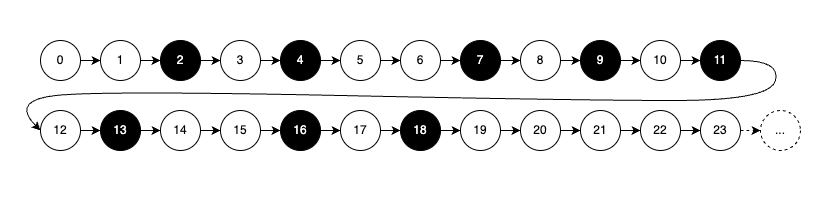
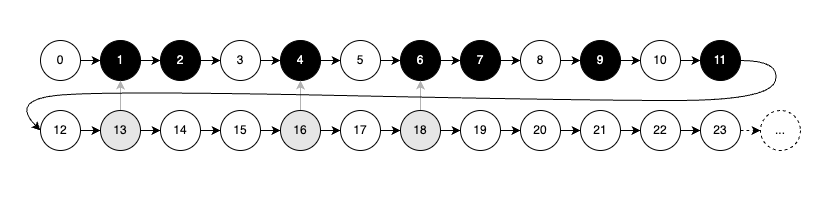
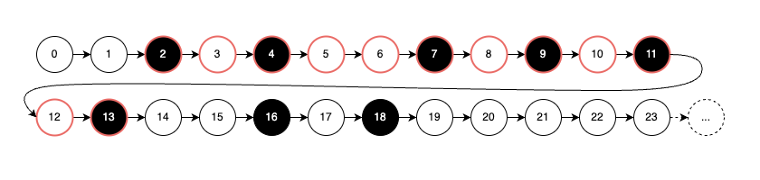
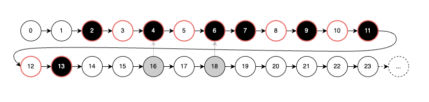
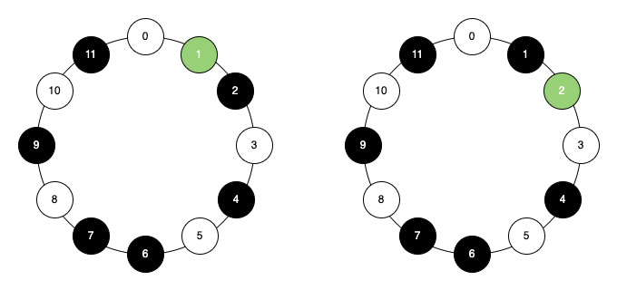
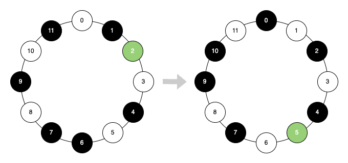
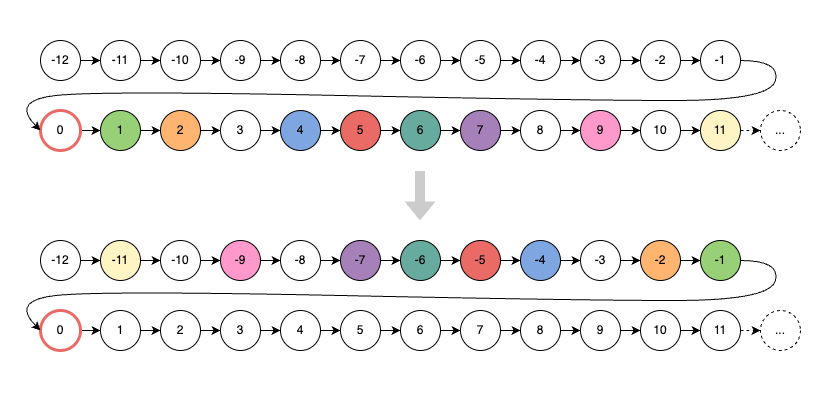
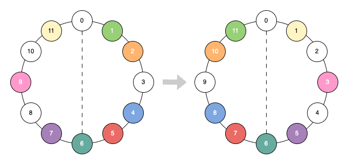
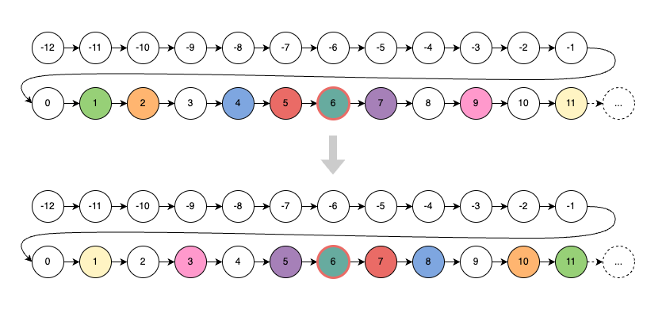

.. _whats_new_0_2_0:

What's new in xenharmlib 0.2.0?
======================================

The development of version 0.2.0 focused on scale transformations
and fundamental building blocks for post-tonal composition. It also
comes with major improvements regarding interface standardization
and speed.

For an in-detail view of all the changes, see the
:ref:`Changelog<changelog_0_2_0>`

.. contents:: Table of Contents
   :depth: 1
   :local:
   :backlinks: none

Convenience Features for Scales
--------------------------------

In 0.1.x explicit definitions of scales were unnecessarily tedious. The most
concise way to define a G major scale by naming the notes was something
like this:

.. testsetup::

   from xenharmlib import EDOTuning
   from xenharmlib import UpDownNotation
   
   edo12 = EDOTuning(12)
   n_edo12 = UpDownNotation(edo12)
   edo31 = EDOTuning(31)
   n_edo31 = UpDownNotation(edo31)

.. testcode::

   g_maj_scale = n_edo31.note_scale(
       [
           n_edo31.note(*args) for args in \
           [('G', 0), ('A', 0), ('B', 0), ('C', 1),
           ('D', 1), ('E', 1), ('F#', 1)]
       ]
   )

The above object can now be constructed with less visual noise by providing
just the pitch class symbols (operating under the assumption that the desired
notes are given in the correct order). This can be done using the newly
introduced :meth:`~xenharmlib.core.notation.NatAccNotation.pc_scale`
builder method that is available on UpDownNotation:

.. testcode::

   g_maj_scale = n_edo31.pc_scale(
       ['G', 'A', 'B', 'C', 'D', 'E', 'F#']
   )

Following the same logic the tuning object now also provides a method called
:meth:`~xenharmlib.core.tunings.PeriodicTuning.pc_scale` that expects an
iterable of pitch class indices:

.. testcode::

   g_maj_scale = edo31.pc_scale(
       [0, 18, 23, 28, 5, 10, 15]
   )

Since 0.2.0 pitch scales can also be defined by simply providing an iterable
of (not necessarily ordered) pitch indices. This functionality is provided by
the new :meth:`~xenharmlib.core.tunings.TuningABC.index_scale` method:

.. testcode::

   scale = edo31.index_scale(
       [5, 21, 31, 22, 0, 4, 9, 13]
   )

Extracting a partial subset of a scale was also overly complicated in 0.1.x:
If you wanted to get a tetrad from a major or minor scale you would need to
do something like this:

.. testsetup::

   c_maj_scale = n_edo12.natural_scale()

.. testcode::

   c_maj7 = n_edo12.scale(
       [
           c_maj_scale[0],
           c_maj_scale[2],
           c_maj_scale[4],
           c_maj_scale[6],
       ]
   )

In 0.2.0 this becomes much easier:

.. testcode::

   c_maj7 = c_maj_scale.partial((0, 2, 4, 6))

To learn more read the section
:ref:`Index Masks and Partial Scales<index_masks_and_partial_scales>`
in the Advanced Scale Guide.

Pitch Class Set Arithmetic
-----------------------------

In textbooks on post-tonal theory, the definition of pitch class sets is often
ambiguous. In *some* applications a pitch class set is considered unordered.
In others (for example in normal form calculation) the order is vital.
To account for both cases pitch class sets in xenharmlib are always
*lists* of unique pitch classes.

Xenharmlib implements pitch class set arithmetic as a byproduct of scale
arithmetic. Already in version 0.1.x every scale object in xenharmlib had a
:attr:`~xenharmlib.core.pitch_scale.PeriodicPitchScale.pc_indices` property
that would list pitch classes in the order they appear in the scale:

.. testcode::

   scale = edo12.index_scale(
       [2, 4, 7, 9, 11, 13, 16, 18]
   )
   print(scale.pc_indices)

.. testoutput::

   [2, 4, 7, 9, 11, 1, 4, 6]

However, :attr:`~xenharmlib.core.pitch_scale.PeriodicPitchScale.pc_indices`
does not always return a collection of *unique* elements. For example,
in the list above, pitch class 4 appears twice. This is due to the
flexibility of xenharmlib's scale definition. Unlike many traditional
textbook definitions, the scale object permits multiple equivalent
(albeit not identical) pitches to coexist and also allows pitches
to span multiple octaves. See the following diagram for illustration:

In xenharmlib 0.1.x there was already a method to ensure the elements in
:attr:`~xenharmlib.core.pitch_scale.PeriodicPitchScale.pc_indices` were unique:

.. testcode::

   pcsn_scale = scale.pcs_normalized()
   print(pcsn_scale.pc_indices)

.. testoutput::

   [1, 2, 4, 6, 7, 9, 11]

The normalization would transpose every pitch into the first base interval.
This has two effects: First, it guarantees the uniqueness of the pitch classes
in the list. Secondly, it guarantees that pitch classes occur in a strictly
ascending order.

However, this kind of transformation is not always desirable, as it
eliminates the mode information of a scale (for instance, the C major
and A minor scales share the same PCS normal form). A better way to
make the list of pitch classes unique is period normalization which
transposes every pitch into the base interval spanned by the root
pitch of the original scale (highlighted in red below):

This new transformation is introduced with 0.2.0:

.. testcode::

   pn_scale = scale.period_normalized()
   print(pn_scale.pc_indices)

.. testoutput::

   [2, 4, 6, 7, 9, 11, 1]

Period normalization guarantees uniqueness, but not that pitch classes are
in ascending order (as you can see from the jump from 11 to 1). They
guarantee however that at most one such violation of the order occurs.

If visualized as a closed necklace the resulting pitch class set of both
normalizations share the same geometric form, however the starting point
(highlighted in green) is different:

Period normalized scales have a nice quality to it: They form a closed
subset of scales in regard to transposition, meaning that every time
you transpose a period-normalized scale your result will be another
period normalized scale:

.. testcode::

   pn_scale_t3 = pn_scale.transpose(3)
   print(pn_scale_t3.pc_indices)

.. testoutput::

   [5, 7, 9, 10, 0, 2, 4]

From the viewpoint of the
:attr:`~xenharmlib.core.pitch_scale.PeriodicPitchScale.pc_indices` property a
transposition is an addition mod period size (mod 12 in our example).
In the closed necklace visualization, it amounts to a rotation of the
necklace:

To learn more about scale normalization methods read the
:ref:`section on normalization <scale_normalizations>`
in the Advanced Scale Guide.

We now have established how to apply the post-tonal :math:`T_n` operation
on a pitch class set by using scale operations. In the next chapter, you
will learn how to use scale operations to apply the :math:`I` operation.

Scale Reflection / Inversion
--------------------------------------------

Starting with version 0.2.0 scales support the
:meth:`~xenharmlib.core.scale.Scale.reflection` method.
Without any parameters it reflects around the zero element
of the origin context (pitch 0 in tunings, C0 in UpDownNotation).

.. testcode::

   scale = edo12.index_scale(
       [1, 2, 4, 5, 6, 7, 9, 11]
   )
   refl = scale.reflection()
   print(refl)

.. testoutput::

   EDOPitchScale([-11, -9, -7, -6, -5, -4, -2, -1], 12-EDO)

Reflection is most easily understood visually. In the graphic below,
the source and target pitches are represented by the same color.
As shown, reflection is accomplished by calculating the interval
from the reflection point (outlined in red) and applying the
negative of that interval back to the reflection point:

From the perspective of the
:attr:`~xenharmlib.core.pitch_scale.PeriodicPitchScale.pc_indices` property
invoking :meth:`~xenharmlib.core.scale.Scale.reflection` without
a parameter applies the :math:`I` operation on the pitch class set.

.. testcode::

   scale = edo12.index_scale(
       [1, 2, 4, 5, 6, 7, 9, 11]
   )
   refl = scale.reflection()
   print(refl.pc_indices)

.. testoutput::

   [1, 3, 5, 6, 7, 8, 10, 11]

On the closed necklace graph of the pitch class set, this operation is
equivalent to flipping the necklace across the horizontal line passing
through 0.

The method also allows selecting a pitch other than 0 as the axis of
reflection:

.. testcode::

   scale = edo12.index_scale(
       [1, 2, 4, 5, 6, 7, 9, 11]
   )
   refl = scale.reflection(
       edo12.pitch(6)
   )
   print(refl)

.. testoutput::

   EDOPitchScale([1, 3, 5, 6, 7, 8, 10, 11], 12-EDO)

Enharmonic Strategies
--------------------------------------------

Often in post-tonal composition, a composer finds themselves in the position
of remembering which integer values in a pitch class set correspond to a note
name in the more conventional thinking. This might be manageable with 12 tones
but becomes considerably more of a head-scratcher with microtonality. What is
the pitch class 17 in 31-EDO? Was it G? Was it Fx?

For this problem, xenharmlib 0.2.0 implements a feature called enharmonic
strategies that allows you to guess a note if only pitch information is
available:

.. testcode::

   edo31 = EDOTuning(31)
   n_edo31 = UpDownNotation(edo31)

   p17 = edo31.pitch(17)
   note = n_edo31.guess_note(p17)
   print(note)

.. testoutput::

   UpDownNote(Fx, 0, 31-EDO)

By the power of these heuristics you can also use a (post-tonal) integer as
an argument for the transpose method instead of a (tonal) note interval:

.. testcode::

   c_maj_scale = n_edo31.natural_scale()
   transposed = c_maj_scale.transpose(3)
   print(transposed)

.. testoutput::

   UpDownNoteScale([Db0, Eb0, F0, Gb0, Ab0, Bb0, C1], 31-EDO)

The type of this heuristic can be changed and xenharmlib offers even
a documented interface to implement your own from scratch. To learn
more read the :ref:`section on enharmonic strategies<enharmonic_strategies>`
in the advanced notation guide.

Syntactic Sugar for Set Operations
-----------------------------------

Version 0.2.0 introduces infix set operators for scales in line with
python's set interface:

.. testcode::

   C = n_edo31.natural_scale()
   G = n_edo31.pc_scale(
       ['G', 'A', 'B', 'C', 'D', 'E', 'F#']
   )

   print(C | G) # union
   print(C & G) # intersection
   print(C - G) # difference
   print(C ^ G) # symmetric difference

.. testoutput::

    UpDownNoteScale([C0, D0, E0, F0, G0, A0, B0, C1, D1, E1, F#1], 31-EDO)
    UpDownNoteScale([G0, A0, B0], 31-EDO)
    UpDownNoteScale([C0, D0, E0, F0], 31-EDO)
    UpDownNoteScale([C0, D0, E0, F0, C1, D1, E1, F#1], 31-EDO)

Interface Standardization
------------------------------

To allow for better abstract definitions a unified interface is introduced
for both tunings and notations. Note scales and pitch scales can now
be constructed by a method named
:meth:`~xenharmlib.core.origin_context.OriginContext.scale`
(without the :code:`note_` and :code:`pitch_` prefix):

.. testcode::

   n_edo31.scale(
       [n_edo31.note(s, 0) for s in ['C', 'E', 'F', 'G', 'A']]
   )

   edo31.scale(
       [edo31.pitch(i) for i in [0, 6, 9, 14, 19]]
   )

The same goes for intervals:

.. testcode::

   n_edo31.interval(n_edo31.note('D', 0), n_edo31.note('F#', 0))
   edo31.interval(edo31.pitch(0), edo31.pitch(3))

.. note::

   The old builder methods with domain-specific prefixes have
   been deprecated and will be removed in 1.0.0

Note and pitch objects also introduce a more general context attribute
that refers to the tuning on pitch-layer objects and to the notation
on notation-layer objects. With these changes, many functions can be
designed in an agnostic way, meaning they don't need to care if
its arguments originate from the pitch universe or the note universe.

As an example consider the following function:

.. testcode::

   def without_imperfect(scale, fdef):
       """
       Returns a period normalized scale without imperfect
       notes/pitches. A note/pitch is considered imperfect
       if it does not have a fifth above in the scale.

       :param scale: A note scale or pitch scale
       :param fdef: An interval defining the fifth
       """

       scale = scale.period_normalized()
       period_ext = scale | scale.transpose_bi_index(1)

       result = []

       for element in scale:
           fifth_above = element.transpose(fdef)
           if fifth_above in period_ext:
               result.append(element)

       context = scale.origin_context
       return context.scale(result)

The function can now be called with either a note scale:

.. testcode::

   scale = n_edo12.pc_scale(['C', 'D', 'E', 'F', 'G', 'A', 'B'])
   fdef = n_edo12.shorthand_interval('P', 5)
   perfected = without_imperfect(scale, fdef)

   print(perfected)

.. testoutput::

   UpDownNoteScale([C0, D0, E0, F0, G0, A0], 12-EDO)

Or with a pitch scale:

.. testcode::

   scale = edo12.pc_scale([0, 2, 5, 7, 9, 11])
   fdef = edo12.pitch(0).interval(edo12.pitch(7))
   perfected = without_imperfect(scale, fdef)

   print(perfected)

.. testoutput::

   EDOPitchScale([0, 2, 5, 7], 12-EDO)
